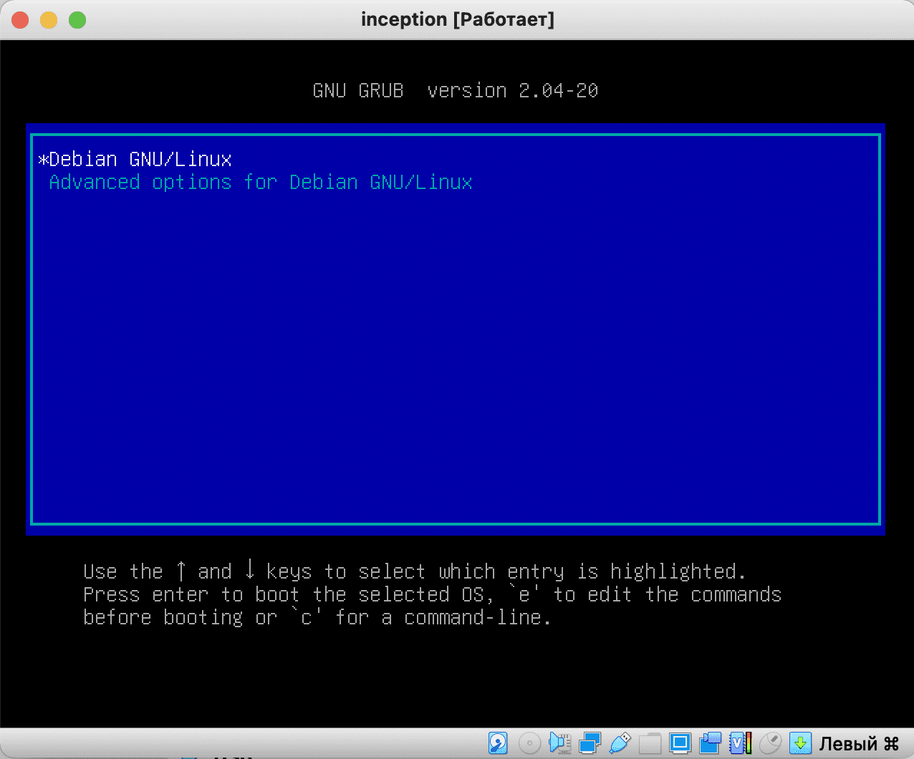
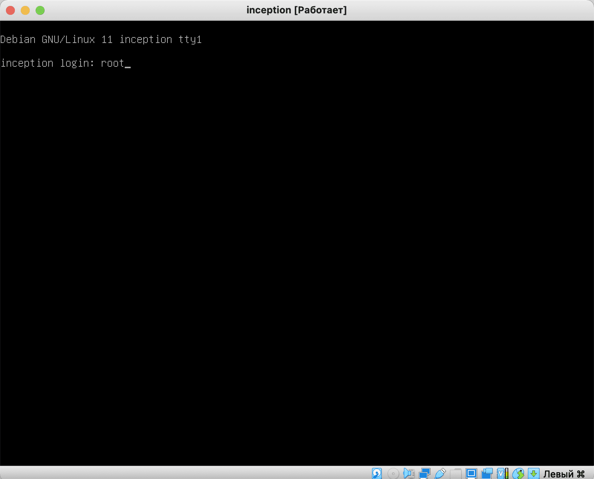
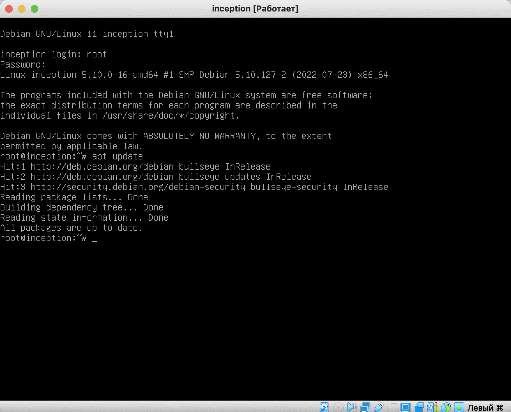
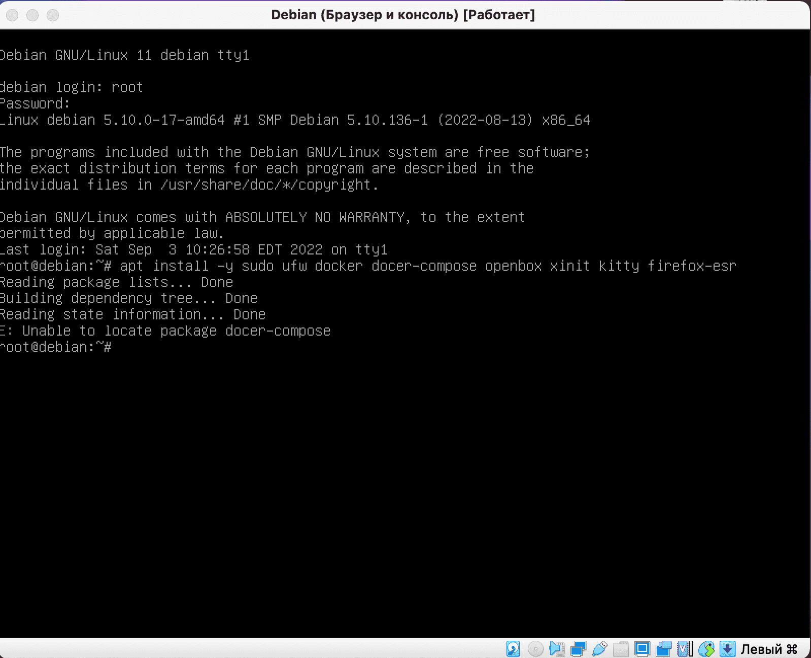
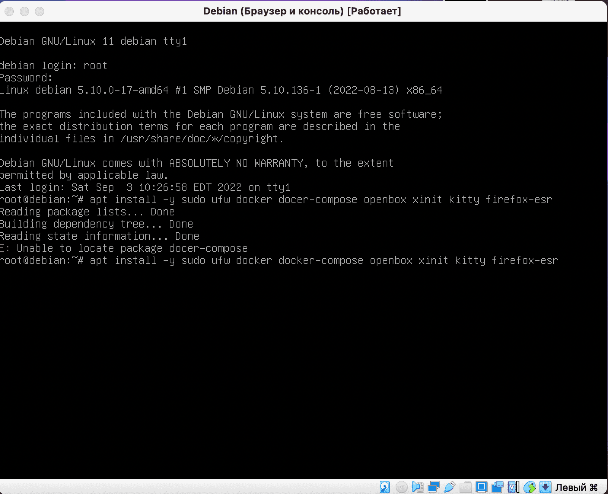
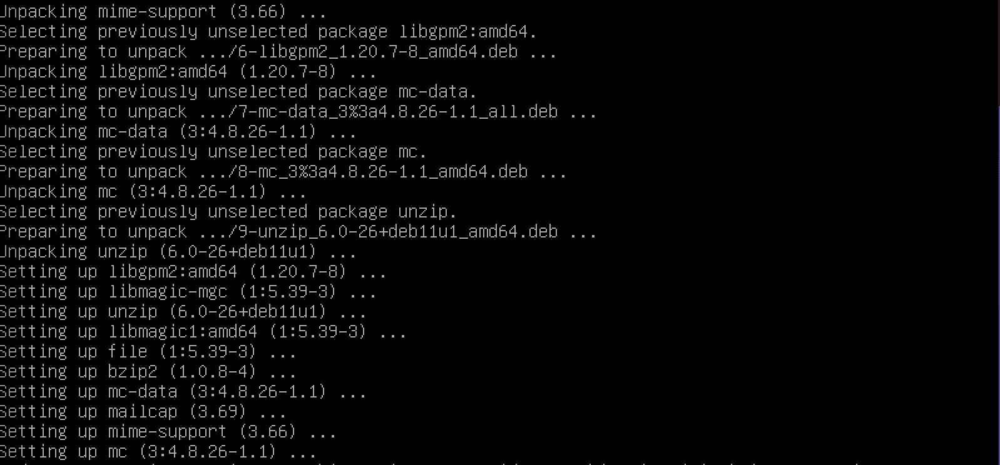
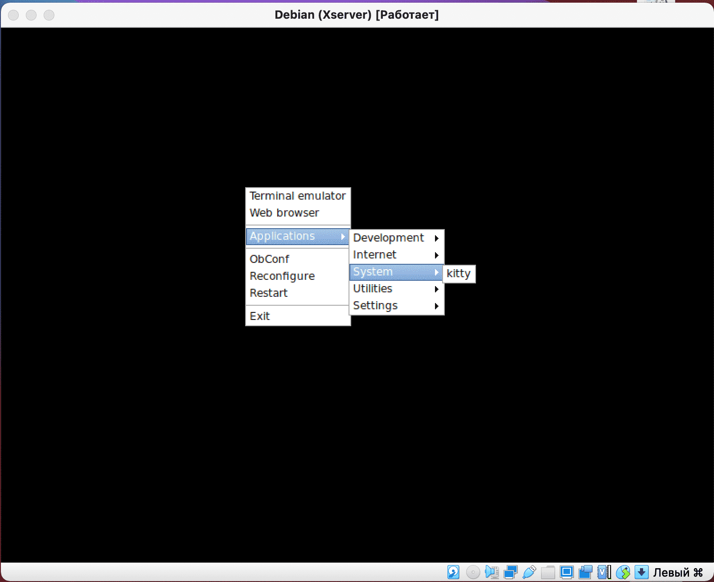
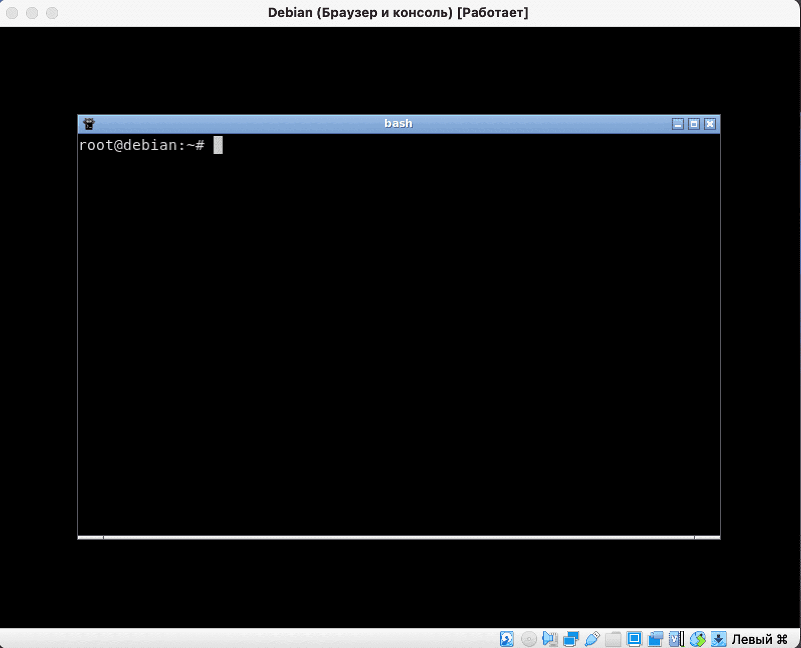
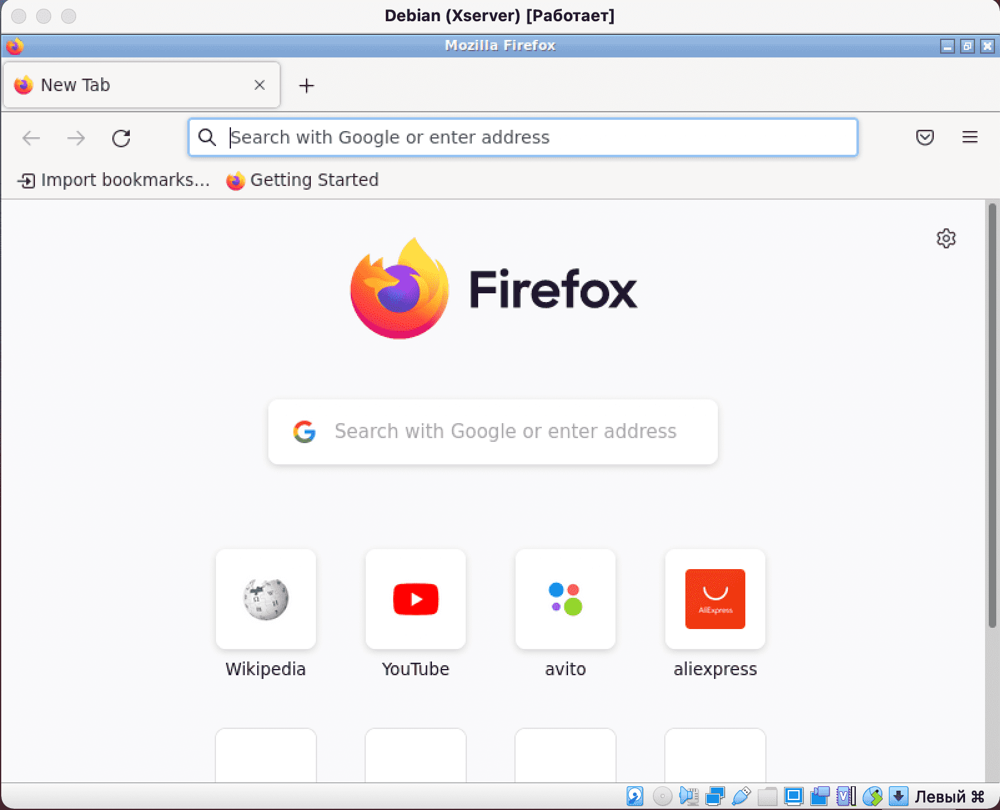
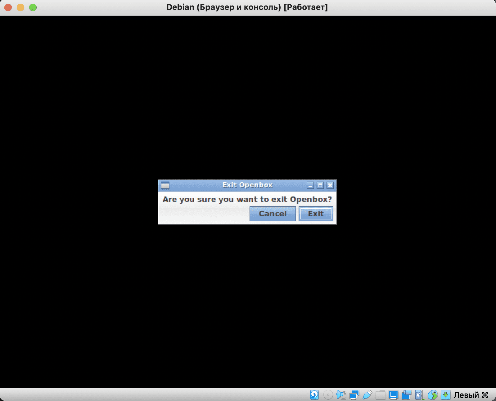

# Установка необходимого софта в Debian

### Шаг 1. Логин в системе

После установки и первой загрузки нам предложат выбрать нашу систему:



Загрузимся под суперпользователем, введя имя пользователя root и пароль.

> ! При вводе пароля сам пароль никак не будет отображаться на экране. Это нормально и сделано в целях безопасности.



### Шаг 2. Обновление списков репозиториев

Обновим репозитории командой ```apt update```:



### Шаг 3. Установка приложений

После этого установим нужные нам приложения следующей командой:

```apt install -y sudo ufw docker docker-compose make openbox xinit kitty firefox-esr```

Мы будем вводить эту команду вручную, так как в виртуальную машину нельзя копипастить. Позже мы откроем порты и подключимся к виртуальной машине через консоль, как к локальному серверу.

А пока мы можем ошибиться при вводе данной команды:


И в этом случае система скажет нам название пакета/пакетов, в имени которых мы ошиблись:



Исправляем имя пакета и запускаем установку:



При установке мы увидим вывод, подобный этому:



Это значит, что мы всё сделали правильно. В конце установки мы снова увидим вывод консоли.

Теперь проверим установленный нами софт. Для начала запустим графическое окружение openbox.

За графику в линукс отвечает x-server. Запускаем его командой ```startx```

Мы увидим чёрный экран. Не стоит отчаиваться, всё работает!

Если мы наведём курсор на этот чёрный квадрат и щелкнем правой кнопкой по нему, то увидим всплывающее меню для запуска приложений. Так работает легковесное окржение openbox. Давайте запустим командную строку внутри нашего GUI:





Теперь мы имеем возможность работать или через терминал GUI, или через терминал TTY.

Запустим наш веб-браузер чтобы проверить его работу. Для этого выберем второй пункт ```Web Browser``` в меню запуска приложений:



В конфигурации нашего GUI поможет утиллита ObConf (четвёртый пункт), которая позволит изменить тему или установить обои.

Итак, мы проверили весь необходимый нам софт. Теперь мы можем выйти из GUI, выбрав последний пункт меню ```Exit```



Итак, мы сделали необходимые настройки, и теперь у нас есть нечто, называемое лол:


А в следующем гайде мы пробросим порты в это нечто.