# Хранение конфигурации в облаке

При работе над проектом может вознинкнуть потребность в переносе конфигурации на другой компьютер. Кому-то это может показаться глупостью, ведь можно делать всё за одним и тем же ПэКа и не париться. Но для пира, пережившего несколько волн бассейнистов и тотальную заполненность кластеров летом переносимость проекта будет не глупостью, а основной полезной фишкой.

Для переноса проекта можно использовать телефон, флешку или облако. В данном примере я буду использовать облако.

Так же обязательно научиться создавать снапшоты - снимки состояния системы, и сохранять систему вместе с ними.

## Шаг 1. Учимся создавать снапшоты

Снапшот - снимок состояния системы. Он подобен сохранению в игре. Подобно тому, как в компьютерной игре не стоит переходить к следующему уровню без сохранения, в проекте inception не стоит делать необдуманных действий без снапшотов. Если вдруг что-то пойдёт не так, систему можно откатить на предыдущий снапшот.

Говорят, один парень не делал бэкапы и снапшоты. Что с ним стало после краша проекта мы можем увидеть в нашем любимом стикерпаке:

Итак, начнём.

> Внимание! Виртуальная машина для создания снимка должна быть выключена!

Заходим в virtualbox и переходим к меню "снимки".

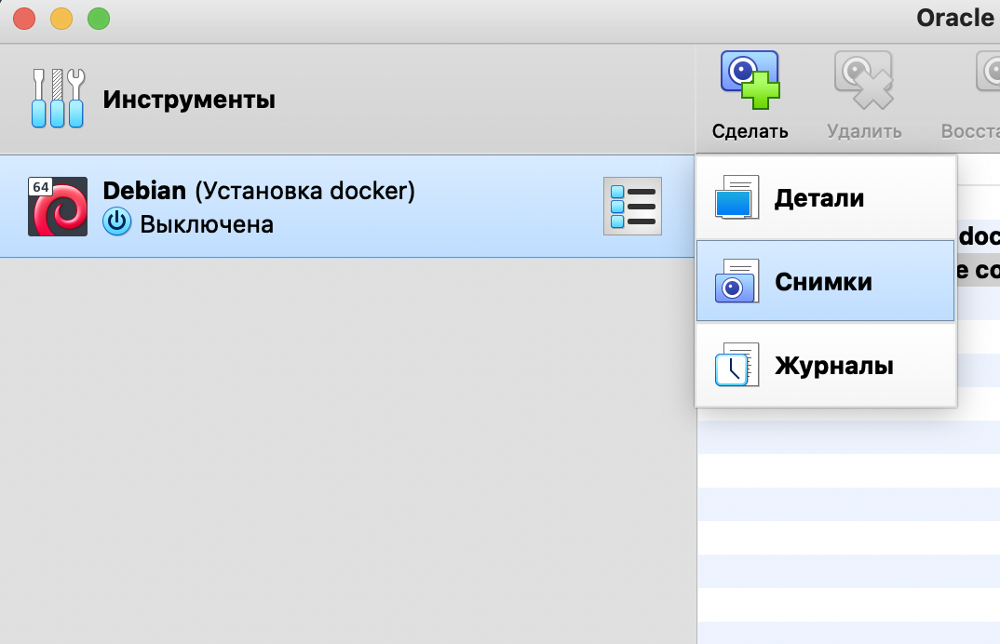

Сверху нажимаем на зелёный плюсик с надписью "сделать" и описываем наши изменения.

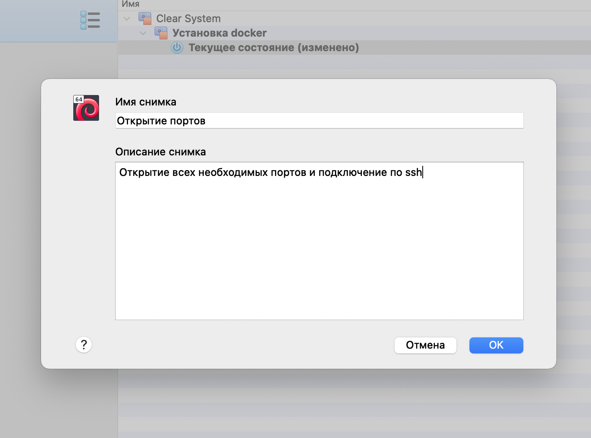

Таким образом мы получаем снимок наших текущих изменений:

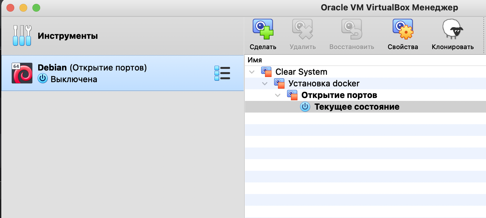

Если что-то пойдёт не так, не обязательно будет удалять и переделывать конфигурацию, можно будет просто откатиться на предыдущую рабочую конфигурацию.

## Шаг 2. Находим установленную конфигурацию

Переходим в папку на goinfre, где храниться наша конфигурация. Если мы посмотрим на размеры файлов, то обнаружим что диск .vhd весит более 2-х гигабайт (в моём случае почти три гига), а большинство современных облачных хранилищ не поддерживают файлы более двух гигабайт.

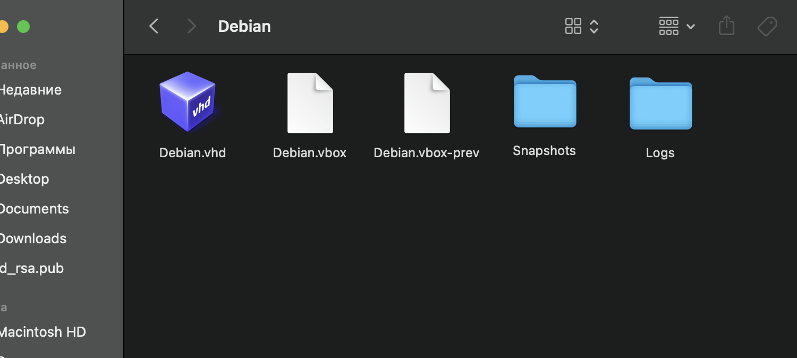

## Шаг 3. Сжимаем большие файлы

Выход есть! ~~через вход~~ Необходимо сжать файл .vhd и папки. Теперь наш диск вместо 3-х гигабайт весит 950 мегабайт!

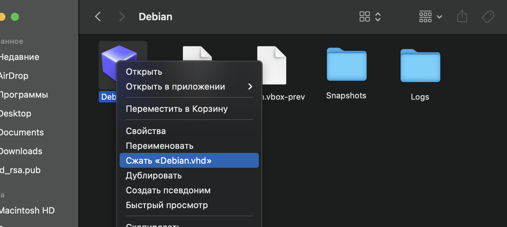

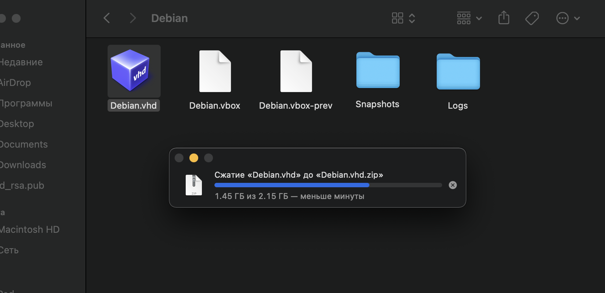

## Шаг 4. Заливаем файлы на облако

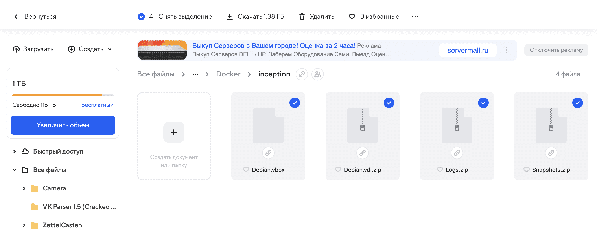

Данная конфигурация у меня весит всего 1,38 ГБ вместе со снапшотами. Теперь её можно будет скачивать и разворачивать на любом школьном маке и даже на домашнем ПК/Ноутбуке.

На школьном маке можно даже не менять конфигурацию в virtualbox - достаточно на новом месте создать папку с таким же названием и по тому же пути в goinfre, скачать туда файлы и распаковать их, а затем запустить virtualbox. Конфигурация будет работать так же, как и на предыдущем ПК.

Для последующего переноса надо будет после всех сохранённых изменений сделать новый снапшот, сжать файлы и снова залить их в облако.

## Шаг 5. Запуск конфигурации на другом школьном mac-е

Если мы залогинимся на другом компьютере, то с сожалением обнаружим, что ничего из goinfree на нём нет, нет и нашей конфигурации:

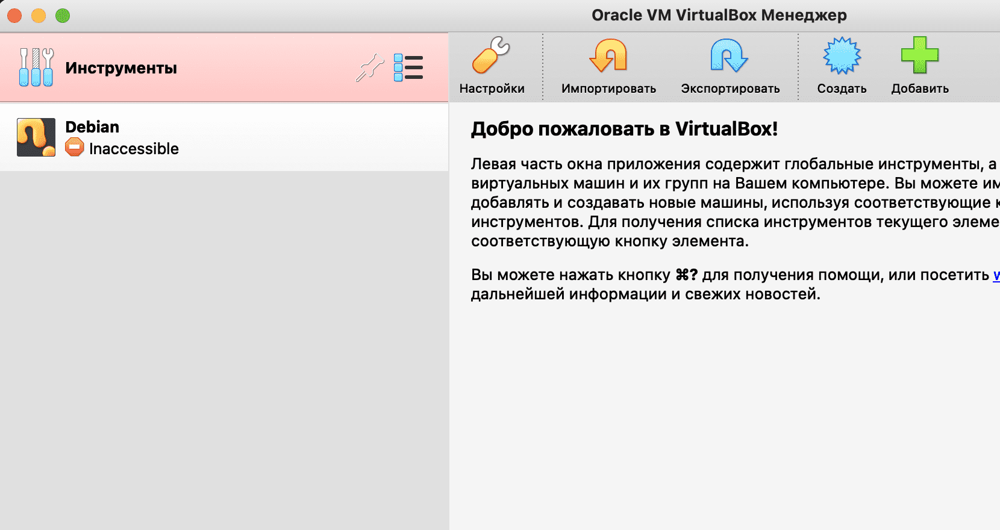

Для сохранения файлов нам скорее всего придётся немного изменить настройки браузера:

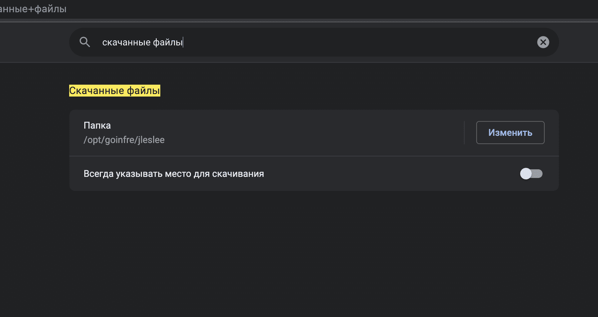

Скачиваем нашу конфигурацию из облака в goinfree и создаём папку, которая называется так же, как папка нашей предыдущей конфигурации на предыдущем месте дислокации:

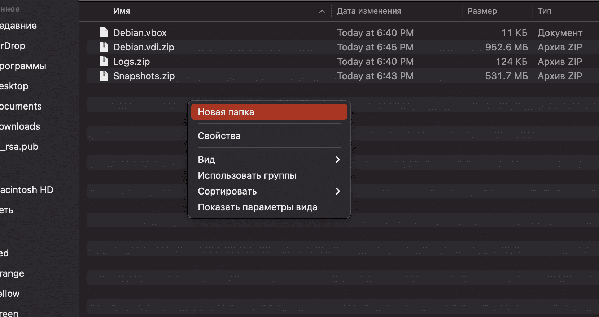

Разархивировируем все наши архивы и получаем следующее:

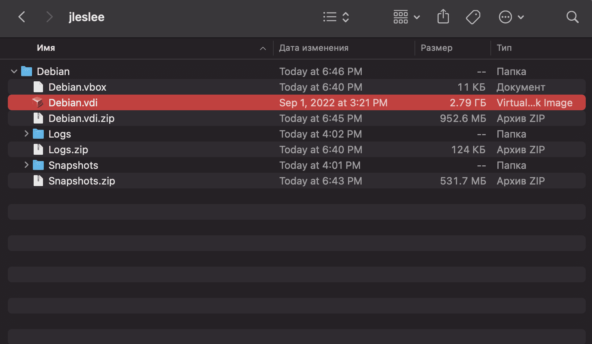

Переходим в virtualbox и видим, что наша конфигурация работает:

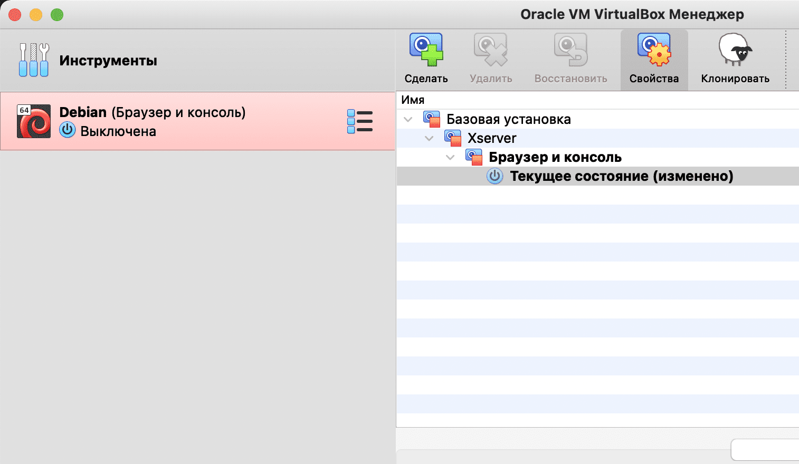

А для развёртывания на домашнем ПК/Ноутбуке нам нужно будет скачать и разархивировать конфигурацию, а затем во вкладке virtualbox "Инструменты" нажать на зелёный плюсик "Добавить", указав папку с файлом Debian.vbox и прочими файлами.