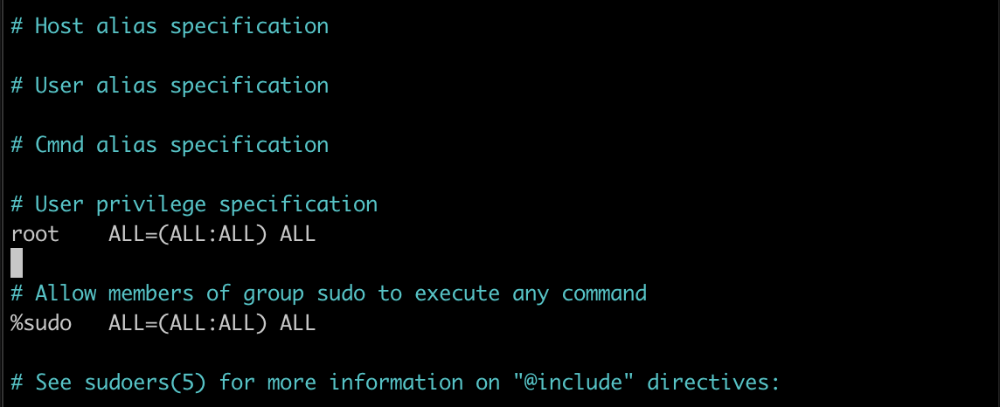
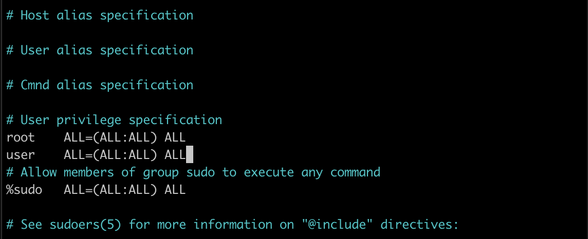
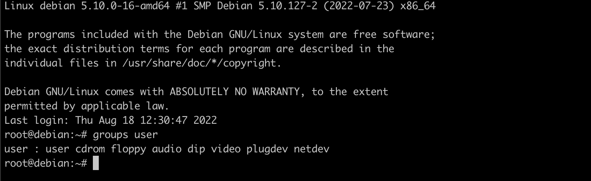
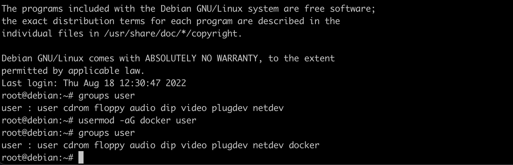
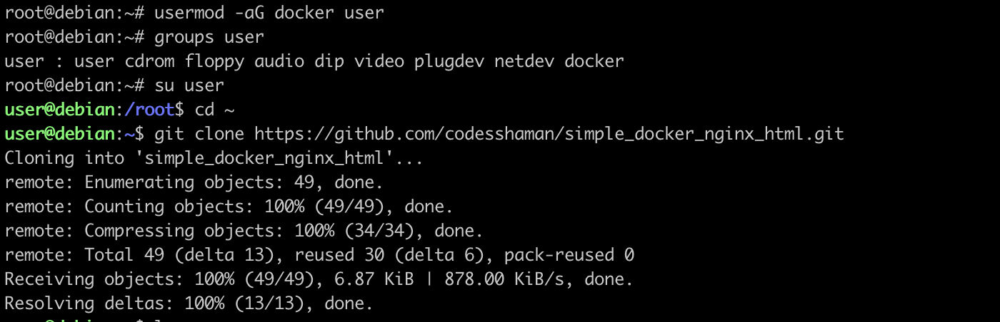
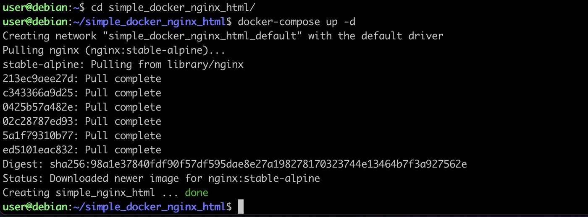
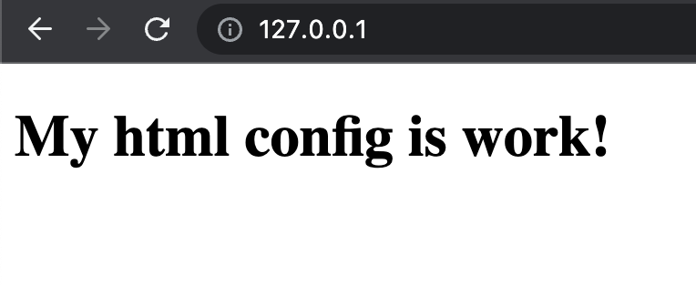
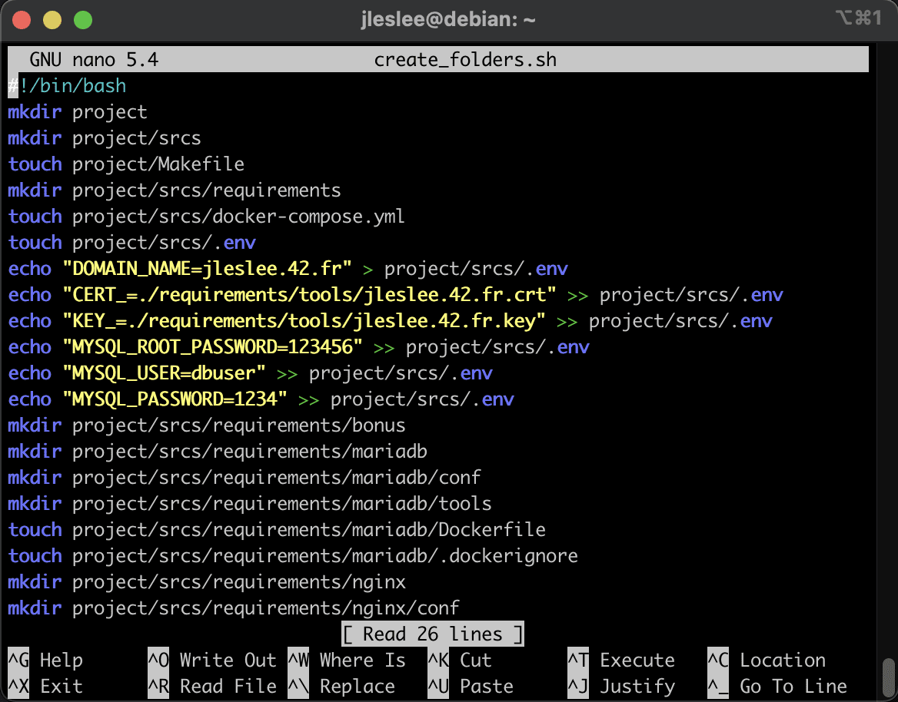

# Предварительная настройка Docker

> Не забудь сделать снимок состояния перед каждым новым этапом сборки!

## Шаг 1. Установка и конфигурация sudo

Тепрь нам нужно начинать работать с докером. Для начала сделаем его удобным для нас, а так же протестируем его работу.

> Все действия данного гайда лучше выполнять через терминал чтобы было возможно копипастить команды и код

На этом этапе нам понадобится наш терминал. Логинимся через терминал, а не в virtualbox, сначала под суперпользователем:

```ssh root@localhost -p 42```

По умолчанию докер запускается либо с привилегией суперпользователя, либо любым пользователем, состоящем в группе docker и обладающим возможность делать запросы под суперпользователем (например, через sudo). 

Ранее мы установили утиллиту sudo, позволяющую пользователю делать запросы от имени root.

Для того, чтобы наш пользователь мог делать такие запросы в системе, правим конфиг /etc/sudoers:

```nano /etc/sudoers```

Наша задача - добавить запись с именем нашего пользователя и правами, равнозначными правам root:





Сохраняем изменения и закрываем файл.

## Шаг 2. Добавление пользователя в группу docker

Теперь добавим нашего пользователя в группу ```docker```. Это позволит нам выполнять команды докера без необходимости вызова sudo. (да, мы установили sudo не для докера, а для удобства работы с системой).

Вот так выглядит список групп нашего пользователя сейчас:

 ```groups <your_nickname>```



Добавим же нашего пользователя в группу командой 

```sudo usermod -aG docker <your_nickname>```

И проверим, что добавление произошло:

```groups <your_nickname>```



Как мы можем видеть, в списке групп в самом конце добавилась группа docker. Это значит, что теперь мы можем вызывать наш докер из под обычного пользователя (если мы проделали добавление в группу не под root, а под пользователем через sudo, надо перелогиниться).

## Шаг 3. Тестовая конфигурация

Так переключимся же на нашего пользователя и перейдём в его домашний каталог:

```su <your_nickname>```

```cd ~/```

Так же скачаем в корень простую конфигурацию из одного докер-контейнера для проверки работы системы:

```git clone https://github.com/codesshaman/simple_docker_nginx_html.git```



Теперь мы можем переходить в эту папку и запускать контейнер:

```cd simple_docker_nginx_html```

```docker-compose up -d```

Через некоторое время наш контейнер сбилдится и мы увидим сообщение об успешном запуске:



А значит, мы можем протестировать запущенный контейнер и правильность настройки конфигурации. Открываем браузер хостовой машины чтобы проверить это.

Если на шаге 02 при пробросе портов мы всё сделали правильно, значит 80-й порт открыт, и зайдя в браузер по адресу локального хоста ```http://127.0.0.1``` (именно http, не https!) мы увидим следующую картину:



Если вдруг мы видим что-либо другое, значит, у нас не открыты порты или 80-й порт чем-то занят на хостовой машине. Пройдитесь по гайду 01 и удостоверьтесь, что порты открыты, а так же проверьте все запущенные приложения. Если среди них есть сервера или иные приложения для работы с локальным хостом, отключаем их.

## Шаг 4. Создание директорий и файлов проекта

Далее нам нужно создать множество директорий и файлов в соответствии с заданием.

Это рутинное занятие, в котором нет ничего сложного: команда ```mkdir``` создаёт директорию, команда ```touch``` создаёт файл, ```cd``` перемещает нас по относительному или абсолютному пути, прописанному после команды, а ```cd ..``` переносит нас на каталог выше. Так же ``pwd`` показывает где мы находимся, ``cd ~`` возвращает нас в домашний каталог.

Если нет желания заниматься данной рутиной, я сделал скрипт make_directories.sh, который выполняет все эти действия автоматически.

``nano make_directories.sh``

Вот его код:

```
#!/bin/bash
mkdir project
mkdir project/srcs
touch project/Makefile
mkdir project/srcs/requirements
touch project/srcs/docker-compose.yml
touch project/srcs/.env
echo "DOMAIN_NAME=<your_nickname>.42.fr" > project/srcs/.env
echo "CERT_=./requirements/tools/<your_nickname>.42.fr.crt" >> project/srcs/.env
echo "KEY_=./requirements/tools/<your_nickname>.42.fr.key" >> project/srcs/.env
echo "DB_NAME=wordpress" >> project/srcs/.env
echo "DB_ROOT=rootpass" >> project/srcs/.env
echo "DB_USER=wpuser" >> project/srcs/.env
echo "DB_PASS=wppass" >> project/srcs/.env
mkdir project/srcs/requirements/bonus
mkdir project/srcs/requirements/mariadb
mkdir project/srcs/requirements/mariadb/conf
touch project/srcs/requirements/mariadb/conf/create_db.sh
mkdir project/srcs/requirements/mariadb/tools
echo "" > project/srcs/requirements/mariadb/tools/.gitkeep
touch project/srcs/requirements/mariadb/Dockerfile
touch project/srcs/requirements/mariadb/.dockerignore
echo ".git" > project/srcs/requirements/mariadb/.dockerignore
echo ".env" >> project/srcs/requirements/mariadb/.dockerignore
mkdir project/srcs/requirements/nginx
mkdir project/srcs/requirements/nginx/conf
touch project/srcs/requirements/nginx/conf/nginx.conf
mkdir project/srcs/requirements/nginx/tools
touch project/srcs/requirements/nginx/Dockerfile
echo ".git" > project/srcs/requirements/mariadb/.dockerignore
echo ".env" >> project/srcs/requirements/mariadb/.dockerignore
mkdir project/srcs/requirements/tools
mkdir project/srcs/requirements/wordpress
mkdir project/srcs/requirements/wordpress/conf
touch project/srcs/requirements/wordpress/conf/wp-config-create.sh
mkdir project/srcs/requirements/wordpress/tools
echo "" > project/srcs/requirements/wordpress/tools/.gitkeep
touch project/srcs/requirements/wordpress/Dockerfile
touch project/srcs/requirements/wordpress/.dockerignore
echo ".git" > project/srcs/requirements/wordpress/.dockerignore
echo ".env" >> project/srcs/requirements/wordpress/.dockerignore
```

> Не забываем менять <your_nickname> на свой ник!

В директориях tools у wordpress и mariadb мы создаём пустой файл .gitkeep, служащий лишь для того, чтобы эти пустые папки попали в индексацию git. Без него они не выгрузятся в репозиторий. А папки эти мы не будем использовать, так как у mariadb и wp будет всего по одному конфигу. Большинство простых операций мы выполним непосредственно в dockerfile, отбросив необходимость в лишних файлах извне.

Создадим файл с расширением .sh, закинув туда данный код:

``cd ~/``

``nano create_folders.sh``



Его необходимо дать разрешение на исполнение:
``chmod +x create_folders.sh``

После этого его можно запустить:

``./create_folders.sh``

И Вуаля - все директории нашего проекта (и даже некоторые необходимые файлы в них) созданы!


Ну а если всё-таки есть желание изучать bash и сделать всё руками, можно посмотреть на содержание скрипта. В нём я использую относительные пути, находясь в корневом каталоге пользователя, однако по каталогам можно перемещаться и делать папки внутри других папок.
