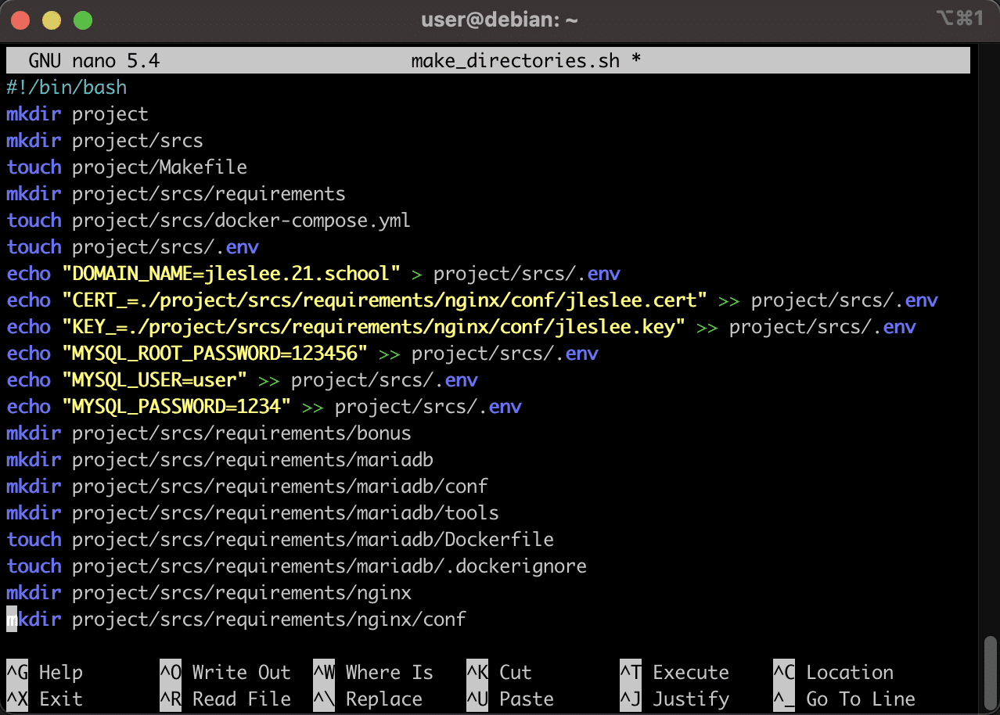
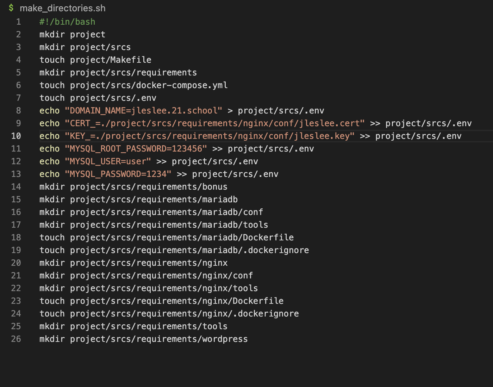

# Создание папок и файлов

После того, как мы сохранили наш проект в облако, мы больше не привязаны к нашей машине. Можно пересесть за любой другой ПК и скачать проект из облака. Если положить все файлы по тому же пути и разархивировать, мы можем запустить виртуальную машину точно так же, как и на предыдущем маке.

Логинимся обязательно через наш терминал, а не в virtualbox, причём не под суперпользователем, а под обычным юзером.

Далее нам нужно создать множество директорий и файлов в соответствии с заданием.

Это рутинное занятие, в котором нет ничего сложного: команда ```mkdir``` создаёт директорию, команда ```touch``` создаёт файл, ```cd``` перемещает нас по относительному или абсолютному пути, прописанному после команды, а ```cd ..``` переносит нас на каталог выше. Так же ``pwd`` показывает где мы находимся, ``cd ~`` возвращает нас в домашний каталог.

Если нет желания заниматься данной рутиной, я сделал скрипт make_directories.sh, который выполняет все эти действия сам.

Скопируем код с гита и создадим файл с расширением .sh, закинув туда данный код:



Его необходимо положить в ту папку, где будет проект (например, в корень - ``~/``), дать ему разрешение на исполнение - ``chmod +x make_directories.sh`` и запустить ``./make_directories.sh``.

И Вуаля - все директории нашего проекта (и даже некоторые необходимые файлы в них) созданы! Ну а если всё-таки есть желание изучать bash и сделать всё руками, можно посмотреть на содержание скрипта. В нём я использую абсолютные пути, однак по каталогам можно перемещаться и делать папки благодаря их относительным путям.

