# Смена локального домена и установка сертификатов

## Шаг 1. Установка mkcert

По заданию нам необходимо установить сампоподписной ssl-сертификат и работать на порту 443, а так же изменить имя нашего домена на username.42.fr. Начнём с сампоподписного сертификата.

Те вещи, которые я расскажу в этом гайде, многим неизвестны. Но при локальной разработке на linux, особенно в сфере web, они будут крайне полезны.


Для локальной разработки как правило используются самоподписные сертификаты. А для генерации самоподписного сертификата очень удобно использовать утилиту mkcert.

Логинимся по ssh под нашим обычным пользователем и выполняем следующие команды:

Обновляем список репозиториев:

```sudo apt update -y```

Устанавливаем утиллиты, которые помогут нам загрузить mkcert:

```sudo apt install -y wget curl libnss3-tools```

Загружаем бинарник mkcert:

```curl -s https://api.github.com/repos/FiloSottile/mkcert/releases/latest| grep browser_download_url  | grep linux-amd64 | cut -d '"' -f 4 | wget -qi -```

Переименовываем загруженный файл:

```mv mkcert-v*-linux-amd64 mkcert```

Разрешаем всем пользователям исполнение файла:

```chmod a+x mkcert```

И наконец перемещаем mkcert в рабочую директорию:

```sudo mv mkcert /usr/local/bin/```

Проверяем, что всё работает, запросив версию mkcert:

```mkcert --version```

Видим следующий вывод:

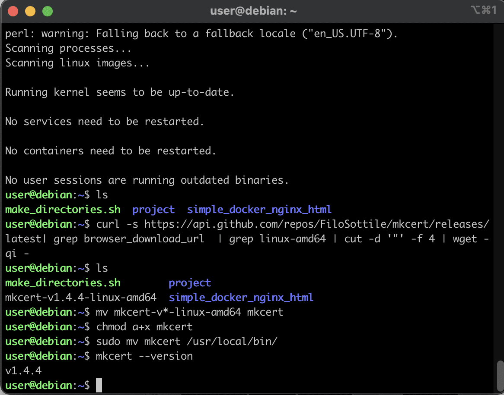

## Шаг 2. Смена локального домена

Далее нам необходимо сменить алиас нашего локального домена (127.0.0.1) на нужный нам nickname.42.fr. Открываем файл /etc/hosts:

```sudo nano /etc/hosts```

И добавляем к ```localhost``` наш ник.42.fr, в моём случае это ```jleslee.42.fr``` (порядок не важен):

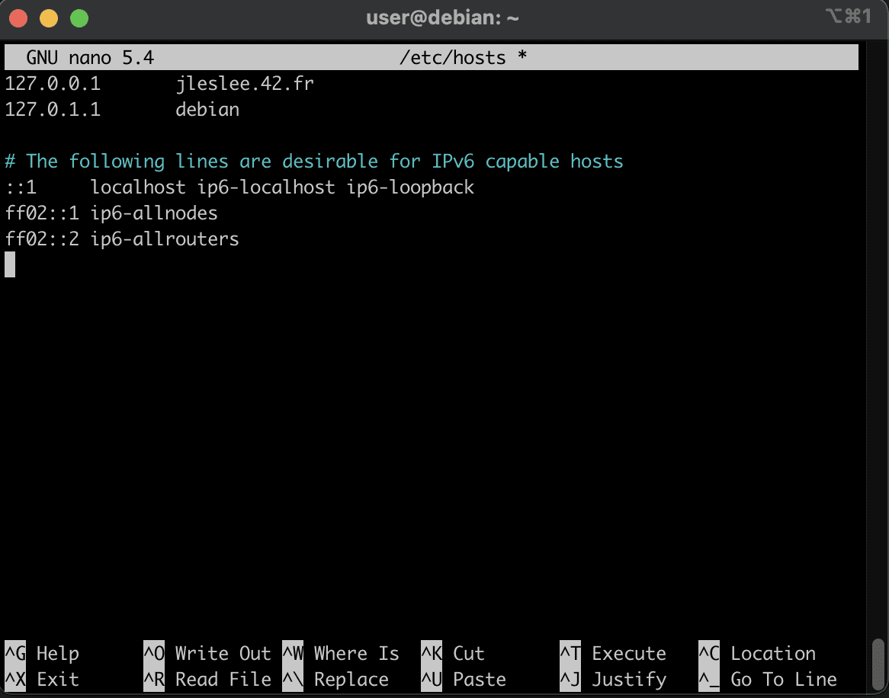

Для проверки работы домена мы можем снова запустить наш тестовый контейнер:

```cd ~/simple_docker_nginx_html/ && docker-compose up -d```

Теперь выполняем следующую команду:

```sudo startx```

Эта команда запустить x-server, который необходим для отрисовки графического окружения (GUI). Мы увидим следующий вывод:

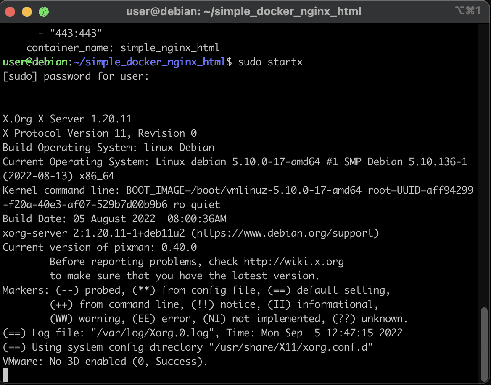

Как видим по данным логам, наша графика успешно запустилась, но... Мы её не увидим. Всё потому, что терминал общается с пользователями при помощи текста и не предназначен для отрисовки графики. Не зря терминальный интерфейс называется TTY (ти-ти-уай) от английского Teletype Writer, одно из названий печатной машинки. Это как бы намекает нам на то, что терминал предназначен только для текста, а стало быть, сделал всё что мог - вывел нам лог об успешном запуске графического окружения.

Графика же запустилась в окошке запущенной в virtualbox системы, и мы можем использовать её только там.

Однако если мы завершим сессию "иксов" в терминале, нажав ```Ctrl + C```, то и графика в виртуалке сразу же упадёт. Ну а если мы уже были залогинены в GUI, то по команде из терминала сверху первой графической сессии запуститься вторая, по выходу на ```Ctrl + C``` она упадёт, оставив включённой первую.

Так работает xserver, в народе "иксы" - если он запущен в терминале, надо открывать окно системы в virtualbox и работать в ней. А ещё проще залогиниться и запустить графику с браузером в virtualbox, а команды выполнять в терминале.

Перейдём в наше графическое окружение в окне virtualbox. Включив веб-браузер, вбиваем туда адрес http://<your_nickname>.42.fr/ заменив <your_nickname> на свой ник. Результат должен быть следующим:

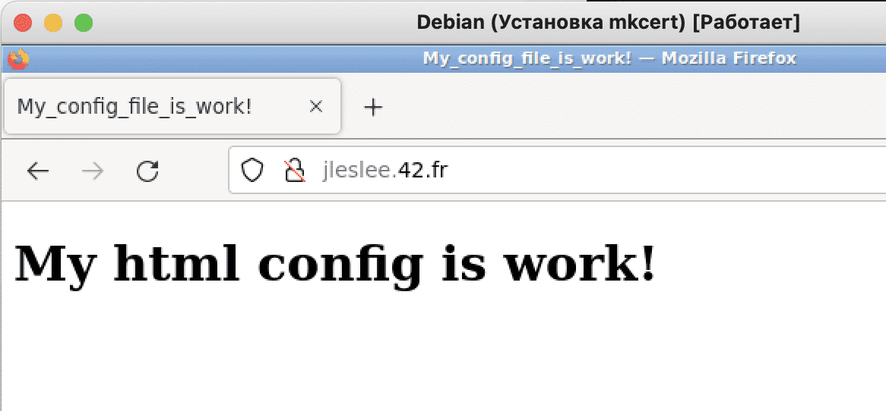

Как мы видим, локальный домен у нас есть, а вот сертификат отсутствует.

## Шаг 3. Получение сертификата

Свернём нашу графическую оболочку и снова откроем териминал. Теперь нам предстоит получить наш самоподписной сертификат.

Положим сертификат и ключ в папку project/srcs/requirements/tools/ (не зря же по заданию нам дана эта папка). Для начала перейдём туда:

```cd ~/project/srcs/requirements/tools/```

Для получения сертификата мы испольузем наш mkcert. Вот так я сгенерирую сертификат для своего домен <your_nickname>.42.fr: 

```mkcert <your_nickname>.42.fr```

Получилось следующее:

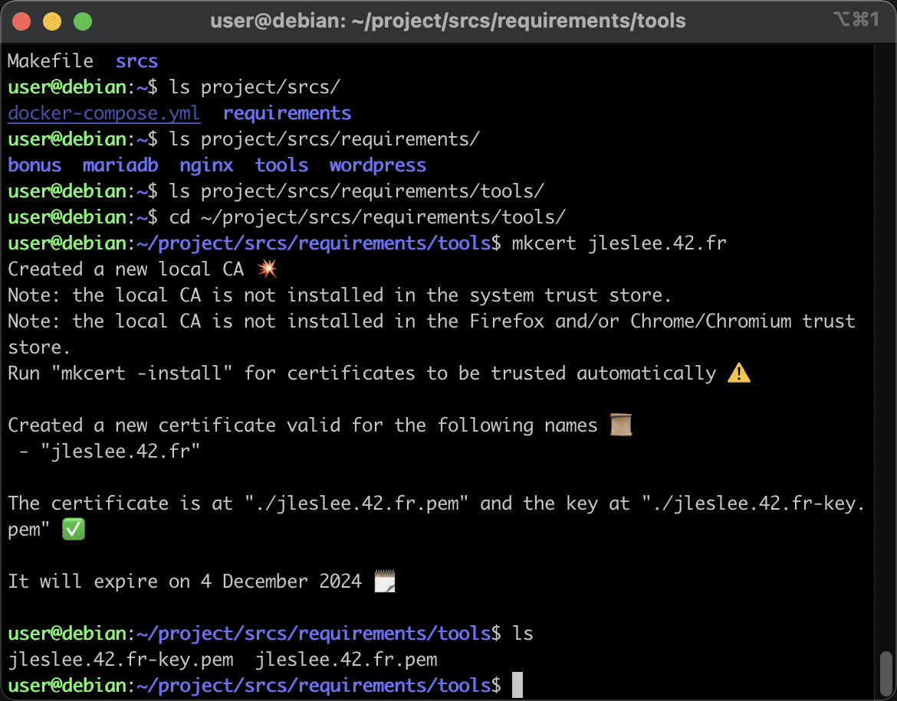

Как видим, наш сертификат действует более двух лет, и это хорошо.

Единственное, что нужно нам для полного счастья - поменять расширения файлов, чтобы сервер nginx их правильно читал. Используем mv, не забывая сменить <your_nickname> на свой ник:

```mv <your_nickname>.42.fr-key.pem <your_nickname>.42.fr.key```

```mv <your_nickname>.42.fr.pem <your_nickname>.42.fr.crt```

И мы имеем в итоге ключ с сертификатом нужных нам форматов.

## Шаг 4. Перенастройка контейнера для https

Теперь нам нужно изменить настройки nginx и тестового проекта чтобы проверить работу https.

Изменим настройки конфига nginx, который лежит по адресу ~/simple_docker_nginx_html/nginx/conf.d/nginx.conf:

```nano ~/simple_docker_nginx_html/nginx/conf.d/nginx.conf```

Стираем всё содержимое файла и копируем туда следующий код:

```
server {
    # Слушаем порт http
    listen      80;
    # Слушаем порт https - ssl
    listen      443 ssl;
    # Задаём домен, на котором мы будем работать:
    server_name  <your_nickname>.42.fr www.<your_nickname>.42.fr;
    # Указываем корневую директорию проекта:
    root    /var/www/public/html;
    # Следующая секция закомментирована для
    # нормальной работы с хостовой машины.
    # Делаем перенаправление с http на https:
    #if ($scheme = 'http') {
    #    return 301 https://<your_nickname>.42.fr$request_uri;
    #}
    # Указываем путь к сертификату и ключу:
    ssl_certificate     /etc/nginx/ssl/<your_nickname>.42.fr.crt;
    ssl_certificate_key /etc/nginx/ssl/<your_nickname>.42.fr.key;
    # Указываем поддерживаемые протоколы tls:
    ssl_protocols            TLSv1.2 TLSv1.3;
    # Указываем опции кэширования и таймауты:
    ssl_session_timeout 10m;
    keepalive_timeout 70;
    # Говорим серверу, файл с каким расширением
    # нужно искать в нашей корневой папке (root)
    location / {
        try_files $uri /index.html;
    }
}
```

Мы можем убедиться, что кириллические комментарии после копипаста сохраняются в неверной кодировки, однако на работу нашего проекта это никак не повлияет:


Обязательно поменяем в пяти местах <your_nickname> на свой ник! Теперь нам нужно перейти в папку тестового проекта и остановить контейнер:

```cd ~/simple_docker_nginx_html/ && docker-compose down```

Затем открываем наш docker-compose.yml:

```nano docker-compose.yml```

В раздел volumes добавляем ещё один раздел с нашими ключами:

```- /home/${USER}/project/srcs/requirements/tools:/etc/nginx/ssl```, где ${USER} - переменная, которая подставит сюда имя нашего пользователя из окружения $PATH.

В общем, позаботимся о том, чтобы пути к сертификатам были прописаны правильно, а так же откроем порт 443 в разделе ports:

```
version: '3'

services:
  nginx:
    image: nginx:stable-alpine
    volumes:
      - ./public:/var/www/public/
      - ./nginx/conf.d:/etc/nginx/conf.d/
      - /home/${USER}/project/srcs/requirements/tools:/etc/nginx/ssl/
    restart: unless-stopped
    ports:
      - "80:80"
      - "443:443"
    container_name: simple_nginx_html
```

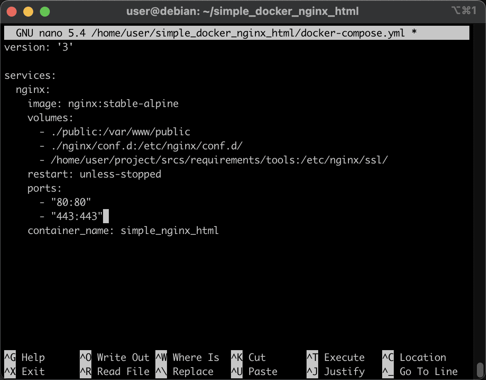

## Шаг 5. Запуск проекта по https в GUI

Теперь вновь запустим наш докер командой

```docker-compose up -d```

Залогинимся в окне системы, запустим там наши "иксы" и перейдём в GUI сервера. Обновим страницу браузера и увидим, что браузер, увы, не доверяет нашему самоподписному сертификату:

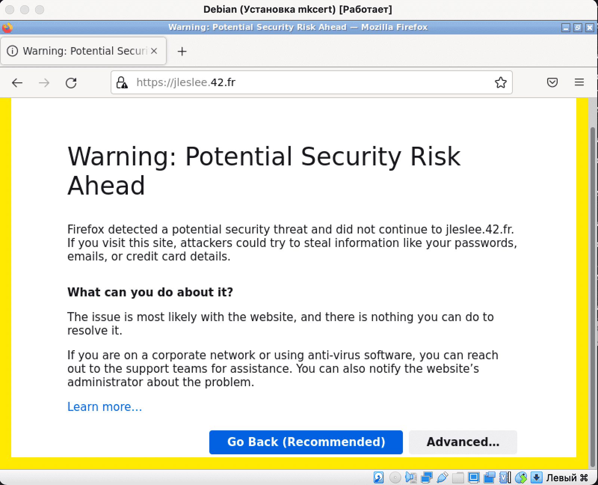


К сожалению, это максимум чего мы можем добиться. Самоподписной сертификат не является доверенным, так как сертификаты выдаются специальными центрами сертификации. Всё, что мы можем - это нажать кнопку "Дополнительно" (Advanced), затем промотать страницу ниже и нажать "Принять риск и продолжить" (Accept the risk and contine):

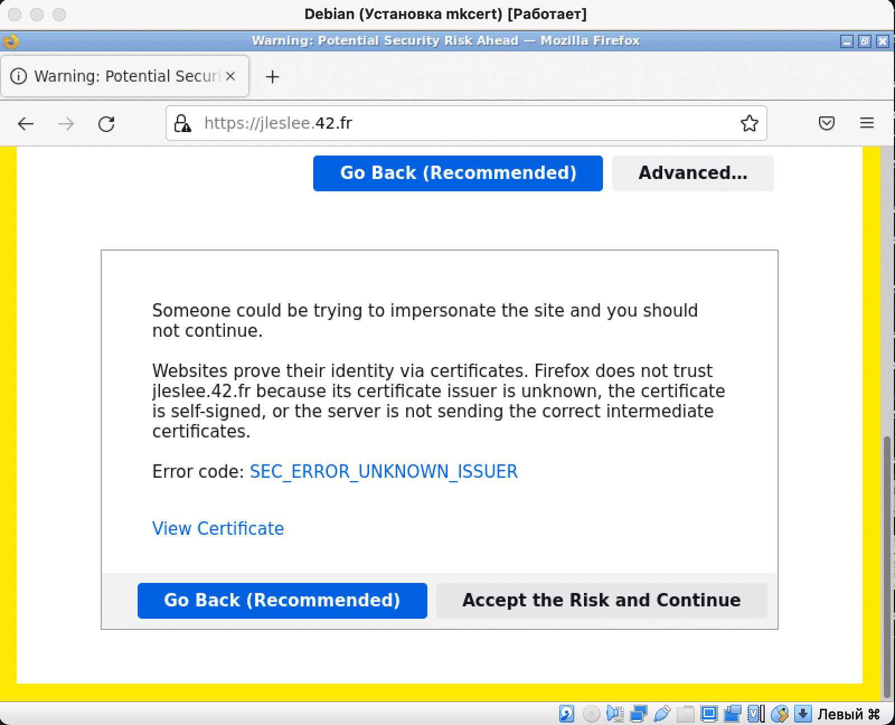

Теперь наш браузер доверяет созданному нами сертификату и наш сайт загружается по ssl. Однако соединение всё равно не считается безопасным. Браузер нужно понять и простить, а нам как веб-разработчику этого вполне хватит для нашего проекта.

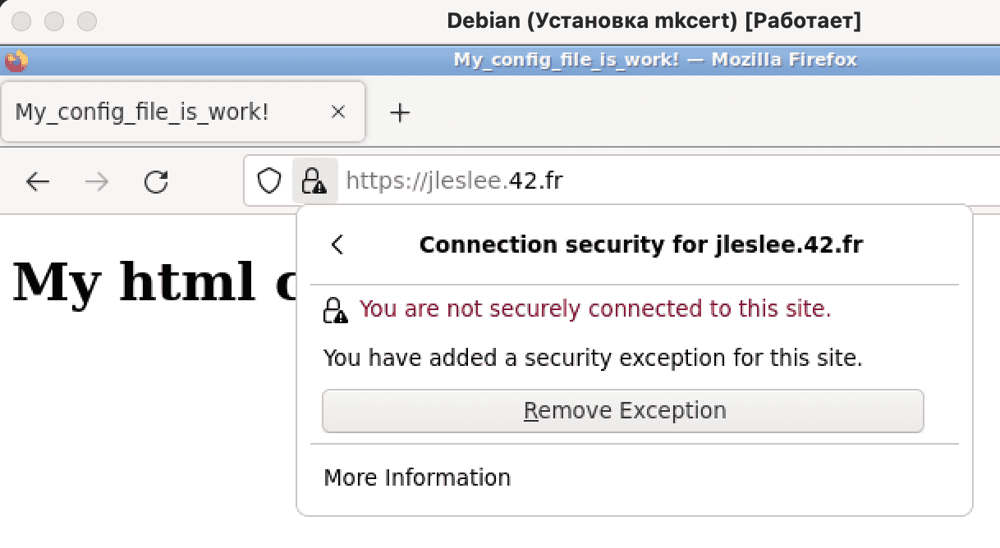

## Шаг 6. Запуск проекта по https на хосте

На хостовой машине наш проект будет доступен по адресу ```127.0.0.1``` до тех пор, пока секция редиректов в конфиге nginx закомментирована. Если раскомментировать её, нас будет редиректить на наш 42.fr, а школьный мак не знает такого сайта.

Здесь тоже будут жалобы на самоподписной ssl. Понять, простить, наджать "дополнительно" -> "перейти на сайт".

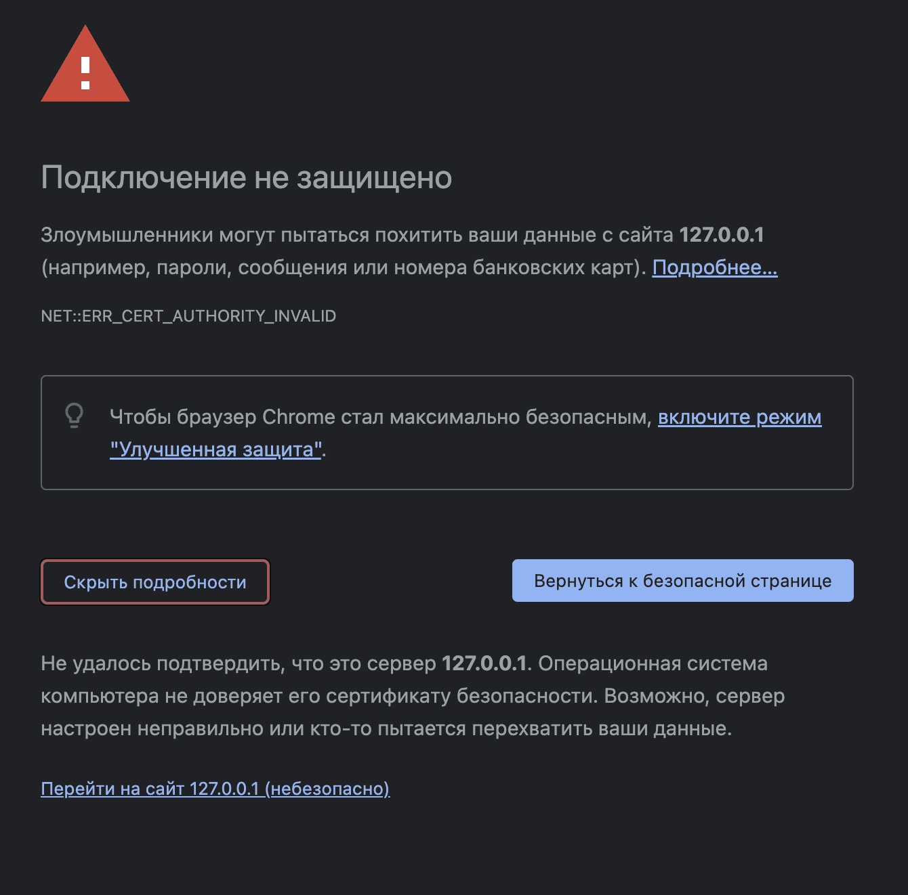

Мы увидим уже привычный "небезопасный" https:

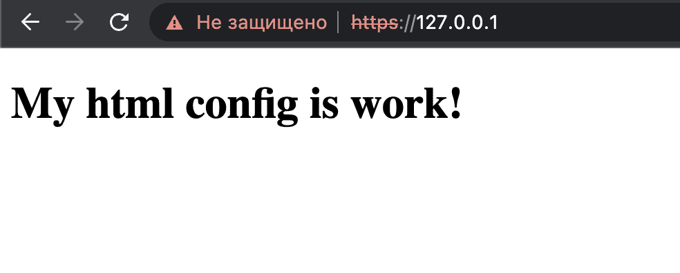

На этом мы можем выключать контейнер командой

```docker-compose down```

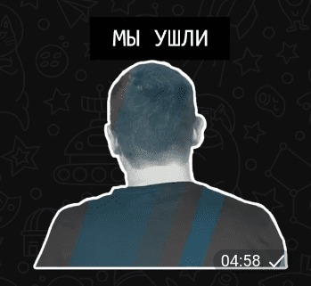

и переходить к созданию Makefile!
