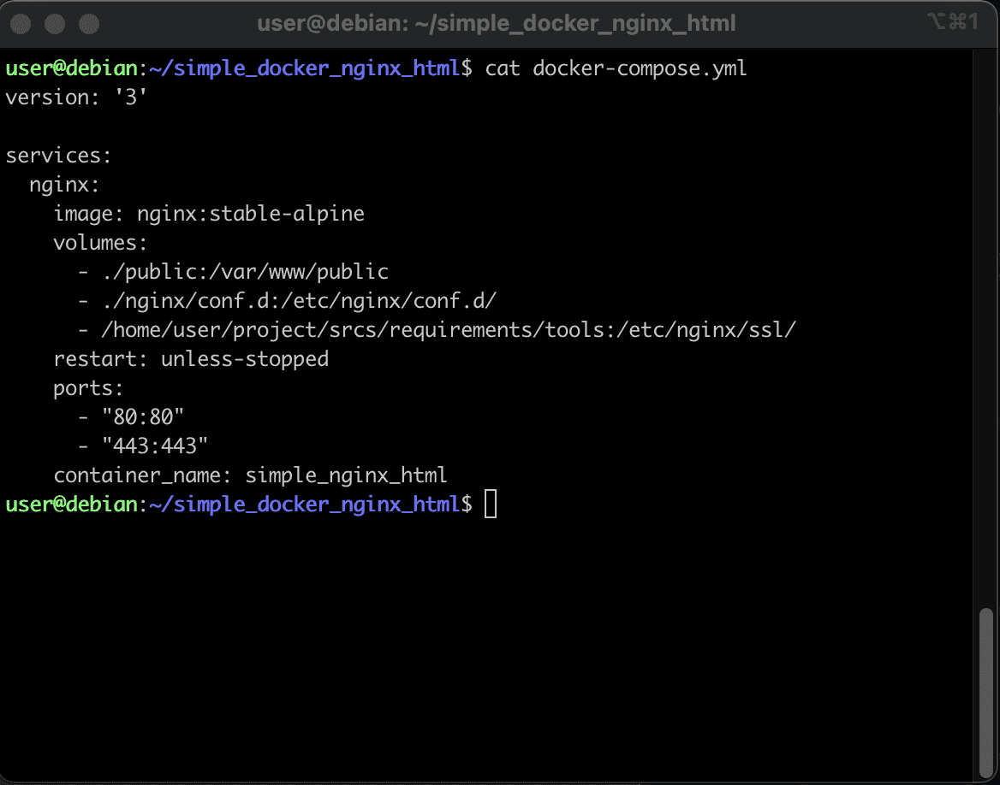

# Создание Makefile

Перед сложным проектом потренируемся так же создавать ```Makefile```. Потренируемся на наших "кошечках" с готовой конфигурацией. На боевом проекте мы усложним мэйк, потому как контейнеров там будет больше. Ну а чтобы понять принципы, лучше всего начать от простого к сложному - написать мэйк к проекту из одного контейнера.

## Шаг 1. Узнаём имя нашего контейнера

Находясь в папке проекта выведем cat-ом наш docker-compose:

```cd ~/simple_docker_nginx_html/ && cat docker-compose.yml```



В разделе ```container_name``` мы увидим имя контейнера: ```simple_nginx_html```. Один из поводов давать контейнерам имена - это тот факт, что по имени к ним удобно будет обращаться.

## Шаг 2. Установка переменной

Создадим в этой же директории (~/simple_docker_nginx_html/) создадим наш Makefile:

``nano ~/simple_docker_nginx_html/Makefile``

Первой переменной нашего Makefile будет переменная name, которой мы присвоим имя контейнера:

```
name = simple_nginx_html
```

В ряде случаев мы будем использовать это, например, для вывода логов или для обращения к конкретному контейнеру по его имени.

## Шаг 3. Запуск конфигурации

Запуск контейнера в docker-compose осушествляется командой docker-compose up -d. Но дело в том, что конфигураций в compose поддерживается великое множество. Часто программисты и devops-инженеры имеют отдельную конфигурацию для разработки, отдельную для тестов и третью для продакшена.

В нашем случае конфигурация одна, и можно прописать в Makefile нашу команду напрямую. Однако поступим хитрее и укажем docker-compose на наш файл конфигурации:

```@docker-compose -f ./docker-compose.yml up -d```

Точка и слэш означают, что мы запускаем файл в той же директории, где лежит Makefile. Прелесть этого подхода в том, что:

а) мы можем указать другой путь до конфигурации, как относительный, так и абсолютный

б) мы можем использовать разные имена конфигурации, например, test.yml и deploy.yml вместо канонического названия docker-compose.yml

Таким образом наша секция all будет выглядеть следующим образом:

```
all:
	@printf "Запуск конфигурации ${name}...\n"
	@docker-compose -f ./docker-compose.yml up -d
```

## Шаг 4. Сборка конфигурации

Собирает контейнер команда ```docker-compose up -d --build```. Оформим с её помощью следующую секцию остановки в Makefile, назовём её build:

```
build:
	@printf "Сборка конфигурации ${name}...\n"
	@docker-compose -f ./docker-compose.yml up -d --build
```

## Шаг 5. Остановка конфигурации

Останавливает контейнер команда ```docker-compose down```. Оформим с её помощью секцию остановки в Makefile, назовём её, например, down:

```
down:
	@printf "Остановка конфигурации ${name}...\n"
	@docker-compose -f ./docker-compose.yml down
```

## Шаг 6. Пересборка конфигурации

За пересборку контейнеров и применение изменений отвечает команда ```docker-compose up -d --build```. Создадим с этой командой секцию re, отвечающую за пересборку:

```
re:
	@printf "Пересборка конфигурации ${name}...\n"
	@docker-compose -f ./docker-compose.yml up -d --build
```

## Шаг 7. Очистка конфигурации

Ну и как же жить без clean и fclean? Конечно, в докере от этих команд куда меньше толка, чем в си, и результат их работы напрямую не виден. Однако если мы захотим очистить память, удалить лишние разделы и сети докера, они нам пригодятся.

```docker system prune --a``` - команда, удаляющая все неиспользуемые образы.

Если нам нужны только образы запущенных контейнеров, а все остальные уже отработанный материал, тогда выполнив эту команду во время работы контейнеров мы очищаем все неиспользуемые образы.

Создадим секцию clean:

```
clean: down
	@printf "Очистка конфигурации ${name}...\n"
	@docker system prune -a
```

## Шаг 8. Глубокая очистка всех конфигураций

Ну а на fclean мы можем повесить тотальную очистку. Чтобы очистить все образы, которые есть на машине, мы сначала остановим все запущенные контейнеры командой ```docker stop $$(docker ps -qa)```, затем принудительно (с флагом --force) удалим всё, что плохо лежит (да и всё, что хорошо лежит - тоже).

Далее мы удалим все сети и все подключенные разделы. Наш код будет выглядеть следующим образом:

```
fclean:
	@printf "Полная очистка всех конфигураций docker\n"
	@docker stop $$(docker ps -qa)
	@docker system prune --all --force --volumes
	@docker network prune --force
	@docker volume prune --force
```

Выполнять ```make fclean``` стоит только тогда, когда очень захочется собрать весь проект make-ом с нуля.

Таким образом весь наш Makefile представляет из себя следующий код:

```
name = simple_nginx_html
all:
	@printf "Запуск конфигурации ${name}...\n"
	@docker-compose -f ./docker-compose.yml up -d

build:
	@printf "Сборка конфигурации ${name}...\n"
	@docker-compose -f ./docker-compose.yml up -d --build

down:
	@printf "Остановка конфигурации ${name}...\n"
	@docker-compose -f ./docker-compose.yml down

re:	down
	@printf "Пересборка конфигурации ${name}...\n"
	@docker-compose -f ./docker-compose.yml up -d --build

clean: down
	@printf "Очистка конфигурации ${name}...\n"
	@docker system prune -a

fclean:
	@printf "Полная очистка всех конфигураций docker\n"
	@docker stop $$(docker ps -qa)
	@docker system prune --all --force --volumes
	@docker network prune --force
	@docker volume prune --force

.PHONY	: all build down re clean fclean
```

Ну и версия с англоязычными комментариями для ленивых (её можно копипастить в терминал):

```
name = simple_nginx_html
all:
	@printf "Launch configuration ${name}...\n"
	@docker-compose -f ./docker-compose.yml up -d

build:
	@printf "Building configuration ${name}...\n"
	@docker-compose -f ./docker-compose.yml up -d --build

down:
	@printf "Stopping configuration ${name}...\n"
	@docker-compose -f ./docker-compose.yml down

re:	down
	@printf "Rebuild configuration ${name}...\n"
	@docker-compose -f ./docker-compose.yml up -d --build

clean: down
	@printf "Cleaning configuration ${name}...\n"
	@docker system prune -a

fclean:
	@printf "Total clean of all configurations docker\n"
	@docker stop $$(docker ps -qa)
	@docker system prune --all --force --volumes
	@docker network prune --force
	@docker volume prune --force

.PHONY	: all build down re clean fclean
```

Да простят меня знатоки английского.

Потестируем данный Makefile на нашем тестовом контейнере и после перейдём уже к боевому проекту!

Давайте же напишем что-то дольше, чем собачье устрой... Ну в общем, вы поняли меня.


> А ещё не забываем сделать снапшот и сохраниться в облачко!
