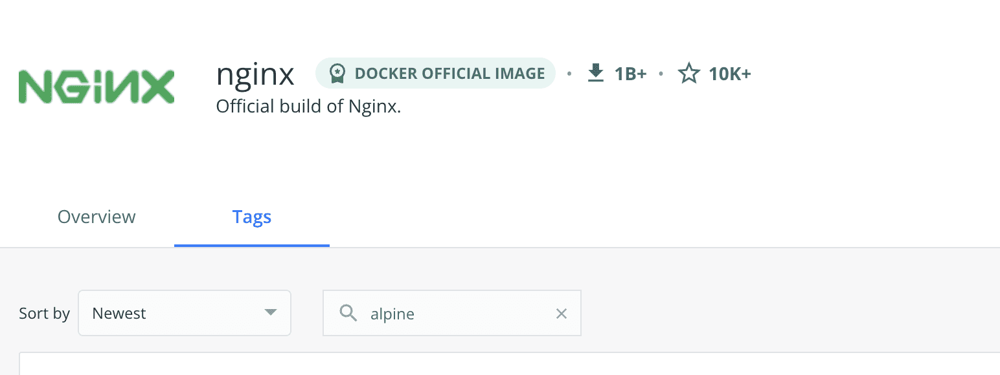
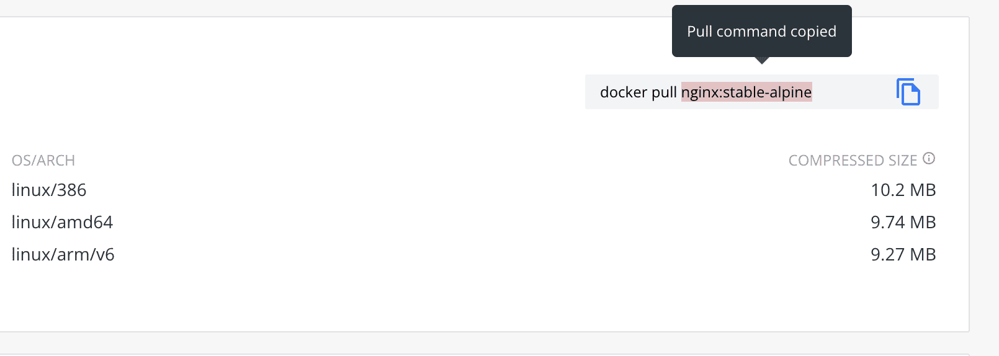
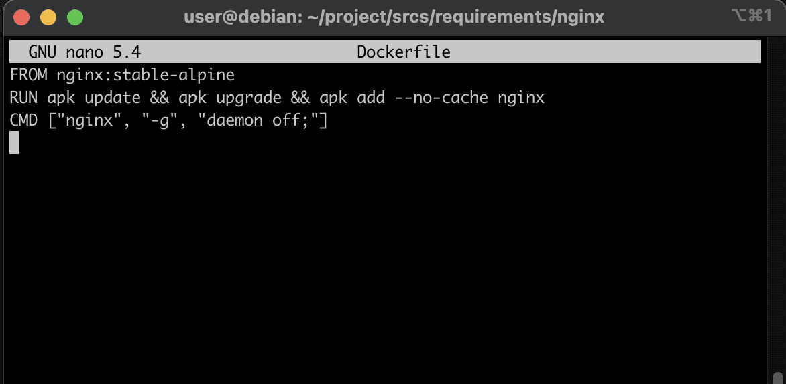

# Создание контейнера Nginx

И вот мы сделали снапшот, сохранили конфигурацию в облако или на флешку и готовы приступать к развёртыванию контейнеров непосредственно проекта.

Сначала давайте познакомимся с технологиями, которые мы будем использовать в наших контейнерах.

В нашем задании дана следующая схема:


Давайте посмотрим, какой софт нам необходим, чтобы реализовать то, что нарисовано на схеме:

Технология | Назначение | Создатель
------ | ------ | ------ | 
Nginx | Проксирующий веб-сервер | Игорь Сысоев (Россия)
PHP	| Скриптовой язык для веб | Расмус Лердорф (Дания)
Php-Fpm	| Набор библиотек для FastCGI API | Андрей Нигматулин (Россия)
Wordpress | Системуа управления содержимым | Мэтью Мулленвег (США)
MariaDB | Реляционная база данных | Микаэль Видениус (Финляндия)
---
Эта таблица сразу же приобщает нас к перкрасному, ибо здесь прекрасно всё.

Лучший проксирующий веб-сервер, созданный нашим соотечественником Игорем Сысоевым, занимающий 30% рынка серверов. Именно на этой прекрасно задокументированной софтине держится 30% интернета и львиная доля больших и высоконагруженных сайтов, ибо именно под высокие нагрузки этот сервер и писался c 2002 года.

Именно его мы будем настраивать в этом гайде, а пока познакомимся с остальными нужными нам технологиями.

Язык PHP создан датчанином Лердорфом для личных целей в 1995 году, однако он быстро завоевал популярность в веб-разработке и до сих пор является одним из лидирующих языков для веба.

Библиотека php-fpm от нашего соотечественника Андрея Нигматулина стала стандартным API между php и веб-серверами, в том числе Nginx-ом. Именно она подружит наш nginx с php. Устанавливается в контейнер с php.

Wordpress - замечательная и лёгкая в настройке CMS - система, изучив которую можно начинать принимать заказы на сайты на фрилансе :). Создана в 2003 году.

MariaDB - легковесный аналог базы данных MySQL. И то и другое - творение финна Видениуса, назвавшего MySQL в честь своей старшей дочери Мю, а MariaDB - в честь младшей, Марии.

Все эти технологии относительно просты, лакончины и функциональны, что делает их прекрасным выбором и для начинающих веб-программистов, и для профессионалов.

И всё это работает под управлением ОС Linux - прекрасного творения финна Линуса Торвальдса, на котором зиждется весь современный интернет, и крутится внутри контейнеров Docker, системы контейнеризации, созданной американцем Соломоном Хайксом. Ядро Линукс появилось в 1992-93, а Docker в 2013-м.


Вот так два американца, двое русских и два финна создали все необходимые нам для задания технологии. И как-то случано между ними затесался живущий в Каннаде датчанин, создатель одной из базовых технологий - самого языка, который используется нами для wordpress.

Итак, приступим к настройке сервера с Nginx.

## Шаг 1. Введение в Docker

Докер образ - это набор окружения, необходимого для запуска определённого софта. От эмуляторов по типу virtualbox он отличается тем, что в контенере не содержится полноценной операционной системы, контейнер использует ядро Linux и внутрь него помещаются не все, а только необходимые для запуска софта программы и библиотеки.

Таким образом контейнер весит значительно меньше, чем эмулируемая система. Убедимся в этом наглядно. Посмотрим, сколько весит наша ОС в установленном виде:


И сравним это с тем же образом одиннадцатого debian на [Docker Hub](https://hub.docker.com/ "docker hub") - официальном хранилище образов Docker:


Образ весит всего 50 МБ в сжатом виде (сжатый диск с Debian у нас весил 950 МБ!). После распаковки этот образ будет весить около 150 МБ. Вот такая значительная разница. И это далеко не предел.

Всё потому, что для запуска отдельного софта не нужна вся полноценная операционная система, достаточно рабочего ядра и некоторого окружения из всех зависимостей - модулей, библиотек, пакетов и скриптов. По такому принципу работает wine, само название которого гласит что Wine - Is Not Emulator. Он помогает запускать виндовые приложения в среде линукс, устанавливая только нужные зависимости и ничего лишнего.

Итак, когда мы закончили ревью и разобрались в отличии эмуляторов и контейнеров, переходим к изучению того, как работает Docker.

## Шаг 2. Поиск нужного образа на DockerHub

В Докере за конфигурацию отвечает специальный файл, который называется Dockerfile. В нём прописывается набор софта, который мы хотим развернуть внутри данного контейнера.

Начнём создавать наш контейнер для веб-сервера Nginx. Я буду подробно описывать те шаги, которые произведу я для настройки nginx-а.

Сначала я перейду на тот самый [Docker Hub](https://hub.docker.com/ "docker hub") и вверху в поиске введу слово ```nginx```. Потом перейду на официальный репозиторий nginx-а (первый в списке с зелёным значком), нажму вкладку "Tags" и забью в поиск тег ```alpine```:



Alpine - самая легковесная система, используемая в Docker и микроконтроллерах, контейнеры с ней будут весить значительно меньше контейнеров с debian или ubuntu. Поэтому везде, где это возможно, нужно стараться использовать эту систему. И дело тут даже не в экономии места, а в скорости отклика - чем меньше в системе составляющих, тем быстрее она рабоатет, и тем меньше бывает сбоев (хотя на самом деле все официальные образы docker как правило - штуки очень надёжные).

Находим в поиске стабильную версию alpine с названием ```stable-alpine``` и копируем её тег из docker pull, нам нужно только название образа: ```nginx:stable-alpine```:



Если стабильные версии образов удовлетворяют нашим требованиям, всегда нужно использовать именно стабильные версии.

## Шаг 3. Создание Dockerfile

Переходим в папку нашего nginx:

```cd ~/project/srcs/requirements/nginx/```

Создаём в ней Dockerfile:

```nano Dockerfile```

И прописываем в нём инструкцию FROM, которая указывает из какого образа мы будем разворачивать наш контейнер:

```FROM nginx:stable-alpine```

Подробнее о инструкциях можно посмотреть в [этом видео](https://www.youtube.com/watch?v=wskg5903K8I "docker от Антона Павленко"), здесь же разберём лишь некоторые из них.

Далее мы прописываем, какой софт и как мы хотим установить внутрь контейнера. В этом нам поможет инструкция RUN.

Инструкция ```RUN``` создаёт новый слой образа с результатом вызванной команды, подобно тому, как система снапшотов сохраняет изменения в виртуальной машине. Собственно, сам образ и состаит из таких вот слоёв-изменений.

Ещё одной особенностью ```RUN``` является то, что сделанные изменения статичны. То есть, ```RUN``` подходит чтобы положить в окружение файлы или установить пакеты, но вот запустить из них приложение не получится, для этого есть другие инструкции. Какие - узнаем дальше.

А пока пропишем (или скопипастим) это:

```RUN	apk update && apk upgrade && apk add --no-cache nginx```

Здесь мы говорим файловому менеджеру apk чтобы он обновил список своих репозиториев в поисках пследних версий софа (apk update), обновил устаревшие пакеты в нашем окружении (apk upgrade) и установил nginx не сохраняя исходники в кэше (apk add --no-cache nginx). Работает почти так же, как ```apt``` в debian.

В конце концов мы должны запустить установленную конфигурацию. Для этого используем инструкцию ```CMD```:

```CMD ["nginx", "-g", "daemon off;"]```

Таким образом мы запускаем nginx в режиме демона, или, выражаясь языком windows, как службу.

Вот, собственно, и весь Dockerfile. Просто, не правда ли?

```
FROM nginx:stable-alpine
RUN	apk update && apk upgrade && apk add --no-cache nginx
CMD ["nginx", "-g", "daemon off;"]
```



Сохраняем, закрываем.

## Шаг 4. Создание файла конфигурации

Естественно, наш nginx не заработает без конфигурационного файла. Напишем же его!

Посмотрев при помощи ```ls``` нашу папку с nginx-ом мы обнаружим в ней директории conf и tools. Стало быть, наша конфигурация должна лежать в папке conf, если мы нормальные белые люди (никакого расизма, просто расхожая фраза).

Создадим наш конфиг прямо отсюда:

```nano conf/nginx.conf```

Так как мы уже тренировались с тестовым контейнером, возьмём похожую конфигурацию, изменив её под php, чтобы она позволяла читать не html, а php файлы wordpress-а. Но на первом этапе мы закомментируем секции, отвечающие за php, и пропишем на время поддержку html (для проверки):
```
server {
    listen      80;
    listen      443 ssl;
    server_name  jleslee.42.fr www.jleslee.42.fr;
    root    /var/www/html;
    index index.php index.html;
#   if ($scheme = 'http') {
#       return 301 https://jleslee.42.fr$request_uri;
#   }
    ssl_certificate     /etc/nginx/ssl/jleslee.42.fr.crt;
    ssl_certificate_key /etc/nginx/ssl/jleslee.42.fr.key;
    ssl_protocols       TLSv1 TLSv1.1 TLSv1.2;
    ssl_session_cache shared:SSL:10m;
    ssl_session_timeout 10m;
    keepalive_timeout 70;
    location / {
        try_files $uri /index.php?$args /index.html;
        add_header Last-Modified $date_gmt;
        add_header Cache-Control 'no-store, no-cache';
        if_modified_since off;
        expires off;
        etag off;
    }
#    location ~ \.php$ {
#        fastcgi_split_path_info ^(.+\.php)(/.+)$;
#        fastcgi_pass wordpress:9000;
#        fastcgi_index index.php;
#        include fastcgi_params;
#        fastcgi_param SCRIPT_FILENAME $document_root$fastcgi_script_name;
#        fastcgi_param PATH_INFO $fastcgi_path_info;
#    }
}
```

Порт 9000 - это как раз порт нашего php-fpm, по которому осуществляется соединение между php и nginx. А wordpress в данном случае - имя нашего контейнера с wordpress-ом. Но пока попытаемся хотя бы просто запустить что-то на nginx-е.

Просто копипастим это в наш проект и сохраняем файл.

А папку tools я по старой привычке использую для ключей, скопировав их туда:

```cp ~/project/srcs/requirements/tools/* ~/project/srcs/requirements/nginx/tools/```

## Шаг 5. Создание конфигурации docker-compose

Docker-compose - это система запуска контейнеров docker, можно сказать, это некая надстройка над docker. Если в docker-файлах мы прописывали, какой софт установить внутри одного контейнерного окружения, то с docker-compose мы можем управлять запуском сразу множества подобных контейнеров, запуская их одной командой.

Для этого переходим на два уровня выше (```../../```) и правим наш уже созданный docker-compose файл:

```nano docker-compose.yml```

Сначала прописываем версию. Последняя версия - третья.

```
version: '3'

services:
  nginx:
```

Первым в списке наших сервисов будет nginx. Ставим два пробела и прописываем это слово.

Далее мы говорим докеру, где лежит наш Dockerfile:

```
    build:
      context: .
      dockerfile: requirements/nginx/Dockerfile
```

Пробрасываем нужный порт (в этом задании мы можем использовать только ssl):

```
    ports:
      - "443:443"
```

Добавляем разделы, чтобы контейнер увидел наш конфиг и наши ключи, а так же обязательно монтируем наш /var/www - ту самую папку из старой конфигурации, которая понадобится нам для пробного запуска nginx. Позже мы удалим её и будем брать файлы из каталога wordpress-а.

```
    volumes:
      - ./requirements/nginx/conf/:/etc/nginx/conf.d/
      - ./requirements/nginx/tools:/etc/nginx/ssl/
      - /home/user/simple_docker_nginx_html/public/html:/var/www/html/
```

Для тестирования добавляем ещё один раздел, примонтировав html нашего старого проекта к новому контейнеру.

```- ./conf:/etc/nginx/conf.d/```

Дальше мы прописываем тип перезапуска (всегда, за исключением команды остановки) и задаём контейнеру имя:

```
    restart: unless-stopped
    container_name: nginx
```

И таким образом мы имеем следующую конфигурацию:

```
  GNU nano 5.4                                                       docker-compose.yml
version: '3'

services:
  nginx:
    build:
      context: .
      dockerfile: requirements/nginx/Dockerfile
    ports:
      - "443:443"
    volumes:
      - ./requirements/nginx/conf/:/etc/nginx/conf.d/
      - ./requirements/nginx/tools:/etc/nginx/ssl/
      - /home/user/simple_docker_nginx_html/public/html:/var/www/html/
    restart: unless-stopped
    container_name: nginx
```

Не забываем выключить тестовую конфигурацию:

```cd ~/simple_docker_nginx_html/```

```docker-compose down```

И запускаем нашу новую конфигурацию:

```cd ~/project/srcs/```

```docker-compose up -d```

И теперь, если мы обратимся к локальному хосту из браузера, мы получим рабочую конфигурацию:


Путём лёгкой замены нескольких значений docker-compose и раскомментирования файла конфигурации мы получим рабочий nginx, поддерживающий tls и работающий с wordpress. Но это будет дальше, на следующем шаге.

А пока делаем снапшоты, сохраняемся в облако и наслаждаемся жизнью. На то мы и devops-инженеры :)