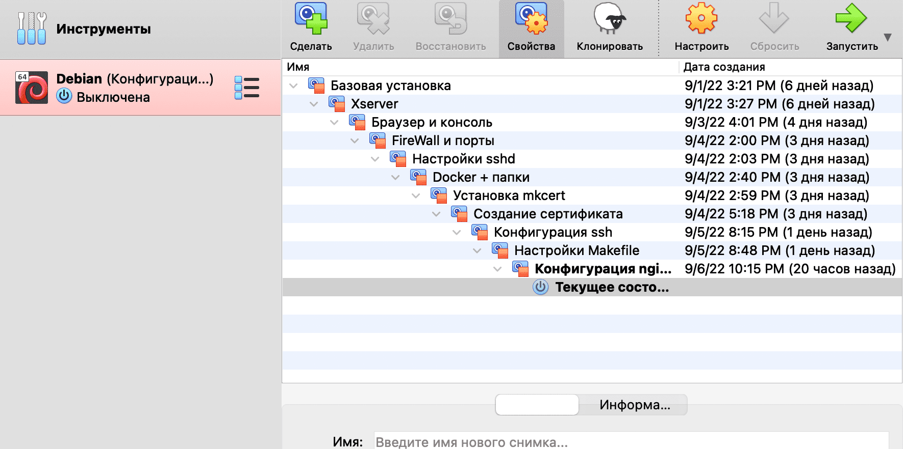
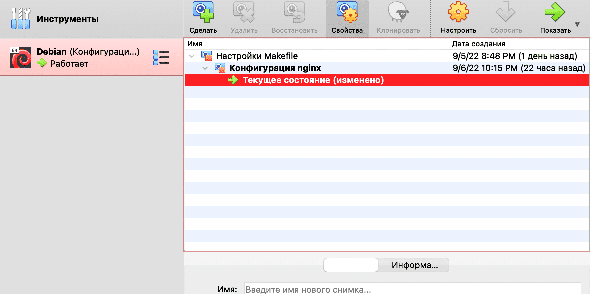
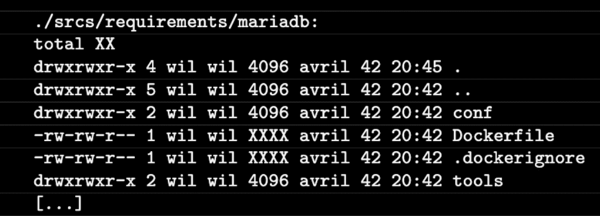

# Создание контейнера Mariadb

На этом шаге размеры моих снапшотов привысили два гига, и мне стало сложно качать их с облака, так как файлам более 2-х гигабайт mail урезает скорость.

Так как мне всё равно не нужно будет возвращаться к старым снапшотам, я решил оставить только новые конфигурации, а всё старое удалить.

Вот как выглядел список моих снапшотов до удаления:



Вот сколько их осталось после. Как можно заметить, я оставил только последние. 



Проблема низкой скорости загрузки решилась.

## Шаг 1. Создание Dockerfile

Посмотрим, чего же от нас, простых русских девопсов, хотят французы:



А всё того же, что от настроек nginx. Dockerfile и необходимые конфигурации. Чтобы понять это нагляднее, проведём ревью, как в случае с созданием конфигурации wordpress:

Вот список того, что нам нужно для настройки контейнера:

- установленные mariadb + mariadb-client
- файл конфигурации mysql
- изменение конфигурации mriadb.
- файл для запуска sql-скрипта
- sql-скрипт для создания базы worpdress

Поэтапный план настройки:

- установить в Dockerfile mariadb + mariadb-client
- изменить конфигурацию mysql (можно сделать прямо в Dockerfile, там всего несколько строк)
- изменить конфиг mariadb (всего одна строка, меняем прямо в Dockerfile)
- скоприровать извне конфиг настройки базы
- создать файл для sql-запроса
- закинуть в этот файл само тело запроса
- выполнить запрос создания базы
- создать конфигурацию для docker-compose
- правильно передать пароли и имена пользователей через переменные окружения

В общем, всё "просто", без ста грамм не разберёшься. Начнём с создания контейнера.

Сформируем базовый образ нашего контейнера. Чтобы не плодить лишних конфигов, поступим следующим образом:

``cd ~/project/srcs``

``nano requirements/mariadb/Dockerfile``

Содержимое файла:

```
FROM alpine:3.16

RUN apk update && apk add --no-cache mariadb mariadb-client

RUN mkdir /var/run/mysqld; \
    chmod 777 /var/run/mysqld; \
    { echo '[mysqld]'; \
      echo 'skip-host-cache'; \
      echo 'skip-name-resolve'; \
      echo 'bind-address=0.0.0.0'; \
    } | tee  /etc/my.cnf.d/docker.cnf; \
    sed -i "s|skip-networking|skip-networking=0|g" \
      /etc/my.cnf.d/mariadb-server.cnf

RUN mysql_install_db --user=mysql --datadir=/var/lib/mysql

EXPOSE 3306

USER mysql
COPY tools/db.sh .
ENTRYPOINT  ["sh", "db.sh"]
CMD ["/usr/bin/mysqld", "--skip-log-error"]
```

Здесь мы запускаем инструкцию RUN в которой устанавливаем без кеширования необходимые нам mariadb и mariadb-client. Далее мы в той же RUN приводим в норму нашу рабочую конфигурацию. Делаем это одним RUN мы потому, что каждая директива RUN создаёт новый слой в docker-образе, и лучше не плодить лишние RUN-ы без надобности. Команда tee отправляет результат вывода echo в файл, а команда sed заменяет строки в файлах по значению. Таким образом мы задаём минимально необходимый набор настроек без создания лишних конфигов внутри одного докер-файла.

Вторым слоем мы создаём базу данных из того, что мы установили и сконфигурировали на предыдущем слое. Указываем путь, где будет храниться база по дефолту. Затем открываем рабочий порт mariadb и переключаемся на пользователя mysql, созданного при установке БД.

И наконец, уже под этим пользователем мы запускаем базу данных.

## Шаг 2. Скрипт для создания БД

Создадим в папке conf скрипт, создающий базу данных для wordpress:

``nano requirements/mariadb/conf/create_db.sh``

Запишем в него следующий код:

```
#!bin/sh

if [ ! -d "/var/lib/mysql/mysql" ]; then

        chown -R mysql:mysql /var/lib/mysql

        # init database
        mysql_install_db --basedir=/usr --datadir=/var/lib/mysql --user=mysql --rpm

        tfile=`mktemp`
        if [ ! -f "$tfile" ]; then
                return 1
        fi
fi

if [ ! -d "/var/lib/mysql/wordpress" ]; then

        cat << EOF > /tmp/create_db.sql
USE mysql;
FLUSH PRIVILEGES;
DELETE FROM     mysql.user WHERE User='';
DROP DATABASE test;
DELETE FROM mysql.db WHERE Db='test';
DELETE FROM mysql.user WHERE User='root' AND Host NOT IN ('localhost', '127.0.0.1', '::1');
ALTER USER 'root'@'localhost' IDENTIFIED BY '${DB_ROOT}';
CREATE DATABASE ${DB_NAME} CHARACTER SET utf8 COLLATE utf8_general_ci;
CREATE USER '${DB_USER}'@'%' IDENTIFIED by '${DB_PASS}';
GRANT ALL PRIVILEGES ON wordpress.* TO '${DB_USER}'@'%';
FLUSH PRIVILEGES;
EOF
        # run init.sql
        /usr/bin/mysqld --user=mysql --bootstrap < /tmp/create_db.sql
        rm -f /tmp/create_db.sql
fi
```

Этот скрипт на bash, в котором всё относительно сложно и непонятно, но он для того и создан, чтобы при виде его любой программист, начинающий изучать контейнеризацию думал "я так больше не могу", "у меня лапки" и вообще "я себе не так docker представлял!".


Ну ничего, если внимательно присмотреться к коду, мы можем понять следующее:

Первый блок кода проверяет, запущен ли mysql (по наличию одноимённой базы), и если нет, то запускает его. Проверка на случай чего нехорошего, по факту наш mysql должен быть установлен и запущен, а этот блок обычно пропускается.

Второй блок проверяет, существует ли база с именем wordpress. Её у нас, конечно же, нету, и, проваливаясь внутрь этого блока, мы записываем в созданный на шаге 1.2 файл для sql-запросов sql-код для создания этой базы. Код использует переменные окружения, которые мы передадим из env-файла. В этом же блоке мы выполняем данный код и удаляем лишний файл конфигурации, умело заметая следы, как настоящие тру-хацкеры.

## Шаг 3. Выполняем скрипт

Итак, скрипт создан, необходимо выполнить его в Dockerfile:

``nano requirements/mariadb/Dockerfile``

Для этого напишем команду:

```
COPY requirements/mariadb/conf/create_db.sh .
RUN sh create_db.sh && rm create_db.sh
```

Но чтобы скрипт сработал, мы должны передать переменные окружения для создания базы. Переменные окружения берутся из файла .env, это те самые секреты, которые, как правило, хранятся отдельно от кода репозитория. Можно хранить их в зашифрованных разделах или даже в менеджерах паролей вроде keepass. Синтаксис у них простейший, положить можно в любое приложение, поддерживающее текстовые поля. Главное чтобы никто не смог получит к ним доступ.

В Docker есть два способа передачи переменных окружения в образ: через ARG и через ENV. Через ARG передаются те аргументы, которые будут использоваться при сборке образа, и не будут задействованы после его старта. Стало быть, все наши секреты мы будем передавать именно через ARG, чтобы они не висели в окружении уже собранного образа.

Через ENV же передаются переменные, которые будут в окружении уже запущенного контейнера. Для наших задач мы не будем использовать их.

Пропишем наши переменные окружения в контейнере:

```
ARG DB_NAME \
    DB_USER \
    DB_PASS
```

Со всем необходимым Dockerfile выглядит следующим образом:

```
FROM alpine:3.16

ARG DB_NAME \
    DB_USER \
    DB_PASS

RUN apk update && apk add --no-cache mariadb mariadb-client

RUN mkdir /var/run/mysqld; \
    chmod 777 /var/run/mysqld; \
    { echo '[mysqld]'; \
      echo 'skip-host-cache'; \
      echo 'skip-name-resolve'; \
      echo 'bind-address=0.0.0.0'; \
    } | tee  /etc/my.cnf.d/docker.cnf; \
    sed -i "s|skip-networking|skip-networking=0|g" \
      /etc/my.cnf.d/mariadb-server.cnf

RUN mysql_install_db --user=mysql --datadir=/var/lib/mysql

EXPOSE 3306

COPY requirements/mariadb/conf/create_db.sh .
RUN sh create_db.sh && rm create_db.sh
USER mysql
CMD ["/usr/bin/mysqld", "--skip-log-error"]
```

## Шаг 4. Конфигурация docker-compose

Продолжаем редактировать наш docker-compose.yml

Секция mariadb выглядит следующим образом:

```
  mariadb:
    build:
      context: .
      dockerfile: mariadb/Dockerfile
      args:
        DB_NAME: ${DB_NAME}
        DB_USER: ${DB_USER}
        DB_PASS: ${DB_PASS}
        DB_ROOT: ${DB_ROOT}
    container_name: mariadb
    ports:
      - "3306:3306"
    restart: always
```
Как мы можем видеть, наши перменные передаются в ARG через секцию args в секции build. Их можно передать только здесь, потому как они запускаются только при билде и не присутствуют в образе, в отличие от ENV, которые передаются через environment-секцию уже внутри сервиса.

Mariadb работает на порту 3306, потому этот порт должен быть открыт.

Весь docker-compose файл:

```
version: '3'

services:
  nginx:
    build:
      context: .
      dockerfile: requirements/nginx/Dockerfile
    container_name: nginx
#    depends_on:
#      - wordpress
    ports:
      - "443:443"
    volumes:
      - ./requirements/nginx/conf/:/etc/nginx/http.d/
      - ./requirements/nginx/tools:/etc/nginx/ssl/
      - /home/${USER}/simple_docker_nginx_html/public/html:/var/www/
    restart: always

  mariadb:
    build:
      context: .
      dockerfile: requirements/mariadb/Dockerfile
      args:
        DB_NAME: ${DB_NAME}
        DB_USER: ${DB_USER}
        DB_PASS: ${DB_PASS}
        DB_ROOT: ${DB_ROOT}
    container_name: mariadb
    ports:
      - "3306:3306"
    restart: always
```
## Шаг 5. Проверка работы базы

Для того, чтобы проверить, всё ли у нас получилось, нужно после запуска контейнера выполнить следующую команду:

``docker exec -it mariadb mysql -u root``

Так мы окажемся в текстовом окружении базы данных:

``MariaDB [(none)]> ``

Здесь мы вводим команду

``show databases;``

В нашем случае вывод должен быть следующим:

```
+--------------------+
| Database           |
+--------------------+
| information_schema |
| mysql              |
| performance_schema |
| sys                |
| wordpress          |
+--------------------+
5 rows in set (0.001 sec)
```
Внизу обязательно должна быть созданная нами база с именем ``wordpress``! Если её нет, значит наш скрипт отработал неправильно или не отработал вообще. Это может быть связано со множеством причин - не скопировался файл скрипта, не передались переменные окружения, не те значения прописаны в .env-файле...

Но если всё сделано правильно, то поздравляю - мы успешно запустили базу данных!

Выходим из окружения командой exit или по Ctrl+D.

