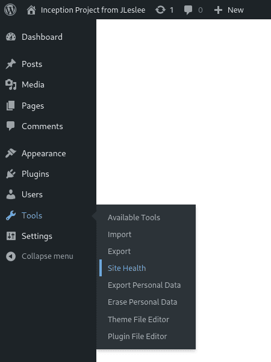
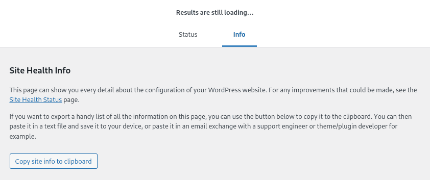
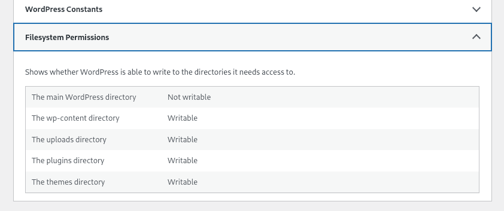
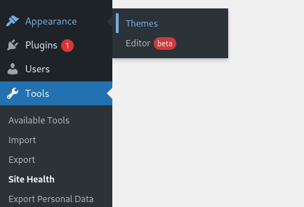
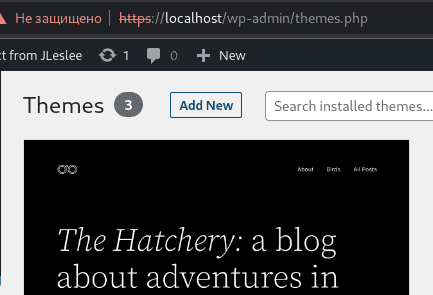
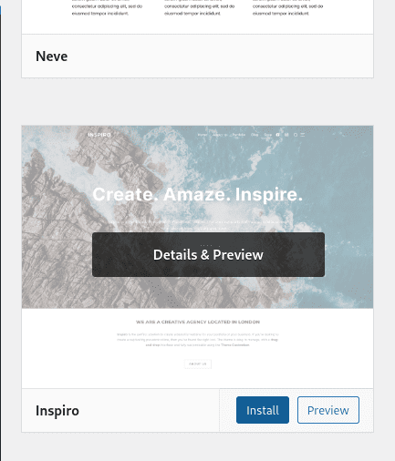
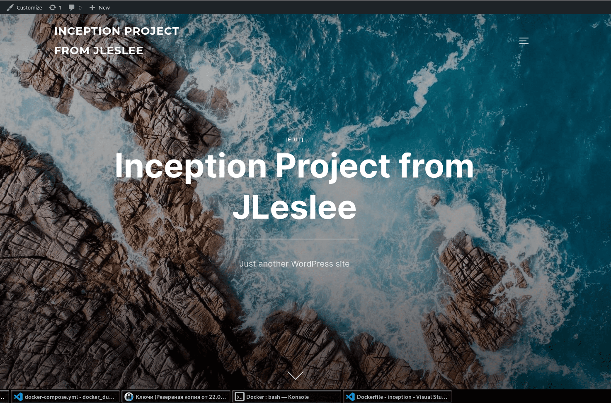
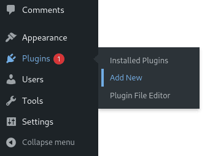
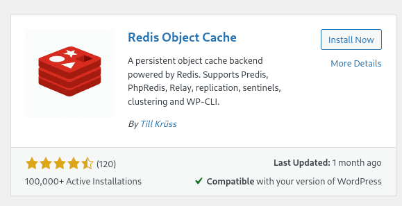

# База Redis для кеша wordpress

Приступим к бонусной части проекта. Для начала создадим базу Redis для кеширования нашего wordpress.

Но сначала сделаем красоту из нашего дефолтного wp ибо видеть на своём сайте убогую тему по умолчанию как-то печально.

Начнём с проверки: посмотрим, всё ли мы правильно сделали. Заходим в инструменты -> здоровье сайта:



На странице здоровья переходим на вкладку информации:


Извиняюсь, не тот скрин... Итак, переходим на вкладку инфо:



В самом низу открываем выпадающий список "разрешения файловой системы". Должно быть так, как показано на скриншоте:



Для ядра wordpress запись должна быть недоступна по соображениям безопасности, для остальных же разделов - доступна.

Если вдруг какие-либо права на запись отсутствуют или что-то не так, как на этом скриншоте, можно ещё раз копипастить Dockerfile из гайда по wordpress и перезапустить проект. Должно заработать.

Далее установим нормальную тему. Переходим в меню "внешний вид -> темы":



Добавить новую тему можно кнопкой "Add New":



Тут мы можем выбрать любую понравившуюся тему. Мне приглянулась Inspiro:



После установки на месте кнопки "установить" появится кнопка "активировать". Нажимаем её и радуемся:



Можно поэкспериментировать так же с установкой плагинов и оформлением хотя бы главной страницы сайта. Просто, для практики. Ну а потом приступать к установки Redis.

## Шаг 1. Установка Redis

Для начала, как обычно, создадим Dockerfile для нашего редиса.

Если мы не знаем, с какой папки начинать, выберем для себя srcs:

``cd ~/project/srcs``

Далее мы создадим папку для бонусов и директории бонусных проектов:

``mkdir requirements/bonus``

``mkdir requirements/bonus/redis``

``mkdir requirements/bonus/vsftpd``

``mkdir requirements/bonus/adminer``

``mkdir requirements/bonus/website``

``mkdir requirements/bonus/website/conf``

В директории redis мы создадим Dockerfile:

``nano requirements/bonus/redis/Dockerfile``

В него добавим следующий код:

```
FROM alpine:3.16

RUN apk update && apk upgrade && \
    apk add --no-cache redis && \
    sed -i "s|bind 127.0.0.1|#bind 127.0.0.1|g"  /etc/redis.conf && \
    sed -i "s|# maxmemory <bytes>|maxmemory 20mb|g"  /etc/redis.conf && \
    echo "maxmemory-policy allkeys-lru" >> /etc/redis.conf

EXPOSE 6379

CMD [ "redis-server" , "/etc/redis.conf" ]
```

Здесь мы выбрали актуальную версию alpine, установили туда редиску и немного поправили ей конфиг. Затем открыли дефолтный порт и запустили сервер редис, скормив ему готовый конфиг. Вуаля.

## Шаг 2. Настройка docker-compose

В docker-compose.yml мы добавим секцию редиса:

```
  redis:
    build:
      context: .
      dockerfile: requirements/bonus/redis/Dockerfile
    container_name: redis
    ports:
      - "6379:6379"
    networks:
      - inception
    restart: always
```

## Шаг 3. Запуск и проверка

Снова перезапускаем конфигурацию. Так как никаких лишних конфигов у нас нет и переменные окружения передавать не надо, можем выйти в папку project и использовать Makefile:

``make re``

После того, как проект соберётся, проверим его работу следующим образом:

``docker exec -it redis redis-cli``

После этой команды мы попадём в окружение редиса:

``127.0.0.1:6379>``

Здесь мы должны ввести простую команду:

``ping``

Ответ должен быть таким:

``PONG``

Если мы получили этот ответ, значит наш сервер работает и прекрасно пингуется. Поздравляю вас с этим замечательным событием!

## Шаг 4. Установка плагина WP Redis

Заходим в wordpress на страницу поиска плагинов:



Вводим в поиск "Redis" и устанавливаем найденный плагин:



После установки нам нужно нажать "Активировать", и наш плагин заработет.

## Шаг 4. Проверка работы Redis

Чтобы проверить работу кэша выполняем следующую команду:

``docker exec -it redis redis-cli monitor``

Если вывод OK - значит у нас всё работает, можем выходить из монитора по Ctrl+C. Редис запущен, расходимся!

