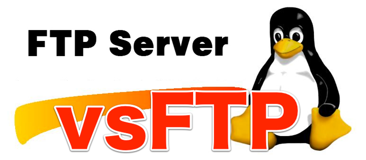
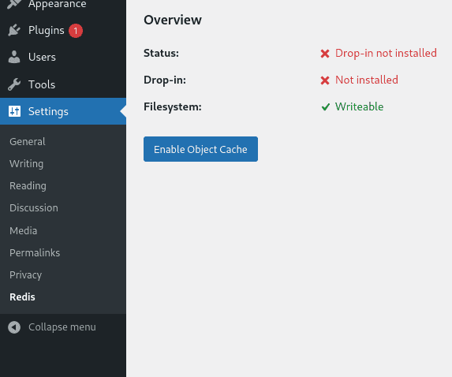
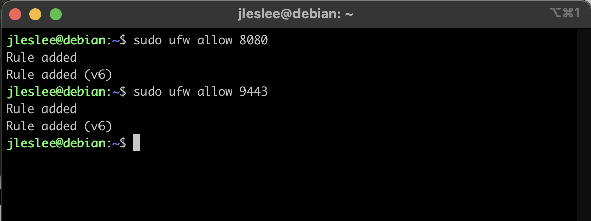
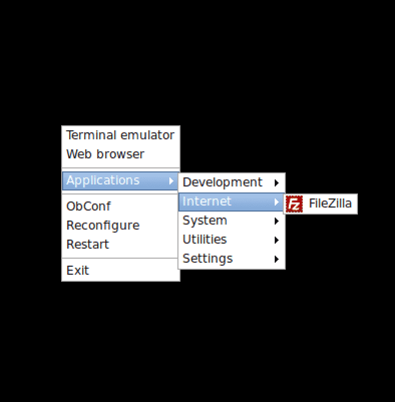
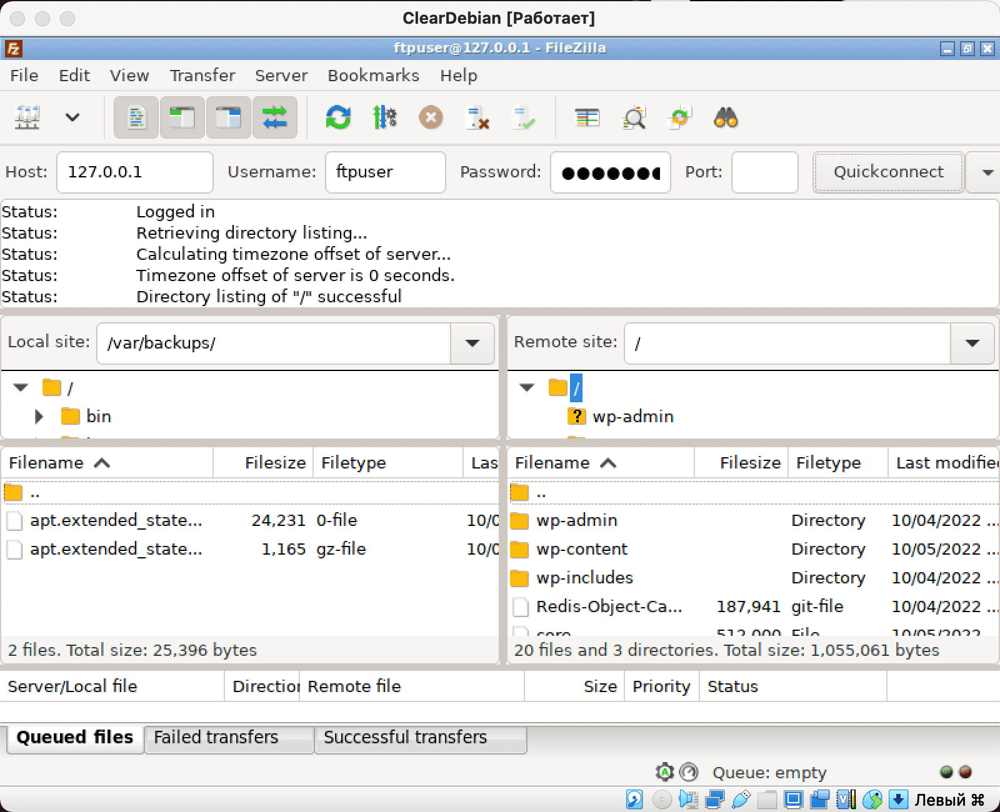

# Файловый сервер vsftpd

Итак, парни, как мы помним из pipex-а, файлы, наряду с процессами - это базовые абстракции linux.


В проекте inception же эти знания нам не пригодятся!

Давайте же будем радоваться тому, что нам не нужно погружаться в низкоуровневое программирование! Ведь всё, что нам сейчас нужно - это всего лишь написать контейнер, содержащий в себе файловый сервер для работы с разделом wordpress. А не эти ваши потоки ввода-вывода...

Мы установим в контейнере сервер vsftpd - Very Saveful File TransPort Daemon, или в переводе с буржуйского - очень защищённый транспортирующий файлы демон. По названию кажется, что выглядеть он должен вот так:


Однако на деле он выглядит так:



У бедняги даже нет своего лого, потому фотошопят его обычно на фоне линуксового пингвина Tux-а.

## Шаг 1. Создание Dockerfile

Как обычно, начинаем с Dockerfile:

``nano requirements/bonus/vsftpd/Dockerfile``

В нём мы получим имя пользователя и пароль для нашего юзера ftp-сервера в переменных через ARG. Затем установим наш vsftpd. Нам нужно создать пользователя для подключения к серверу, и следующим слоем мы это сделаем. Домашним разделом установим для него /var/www, куда мы и примонтируем раздел с нашим wp. Не забудем добавить этого пользователя в группу root чтобы мы могли обрабатывать каталог wordpress-а (иначе просто не хватит прав).

После этого мы правильно настроим файл конфигурации - раскомментим нужные нам параметры и добавим отсутствующие. Корневой папкой сделаем /var/www, откроем 21-й порт и запустим нашего демона, скормив ему только что отконфигурированный файл vsftpd.conf:

```
FROM alpine:3.16

ARG FTP_USR \
    FTP_PWD

RUN apk update && apk upgrade && \
    apk add --no-cache vsftpd

RUN adduser -h /var/www -s /bin/false -D ${FTP_USR} && \
    echo "${FTP_USR}:${FTP_PWD}" | /usr/sbin/chpasswd && \
    adduser ${FTP_USR} root

RUN sed -i "s|#chroot_local_user=YES|chroot_local_user=YES|g"  /etc/vsftpd/vsftpd.conf && \
    sed -i "s|#local_enable=YES|local_enable=YES|g"  /etc/vsftpd/vsftpd.conf && \
    sed -i "s|#write_enable=YES|write_enable=YES|g"  /etc/vsftpd/vsftpd.conf && \
    sed -i "s|#local_umask=022|local_umask=007|g"  /etc/vsftpd/vsftpd.conf

RUN echo "allow_writeable_chroot=YES" >> /etc/vsftpd/vsftpd.conf &&\
    echo 'seccomp_sandbox=NO' >> /etc/vsftpd/vsftpd.conf && \
    echo 'pasv_enable=YES' >> /etc/vsftpd/vsftpd.conf

WORKDIR /var/www

EXPOSE 21

CMD [ "/usr/sbin/vsftpd", "/etc/vsftpd/vsftpd.conf" ]
```

## Шаг 2. Кладём секреты в .env

Открываем .env-файл:

``nano .env``

Добавляем туда строки с именем пользователя и паролем. Таким образом весь файл будет выглядеть следующим образом:

```
DOMAIN_NAME=jleslee.42.fr
CERT_=./requirements/tools/jleslee.42.fr
KEY_=./requirements/tools/jleslee.42.fr
DB_NAME=wordpress
DB_ROOT=rootpass
DB_USER=wpuser
DB_PASS=wppass
FTP_USR=ftpuser
FTP_PWD=ftppass
```

Логин с паролем могут быть любыми.

## Шаг 3. Добавляем секцию в docker-compose

Чтобы переменные из .env-а передались в Dockerfile нужно прописать их и в docker-compose. Секция нашего демона будет выглядеть так:

```
  vsftpd:
    build:
      context: .
      dockerfile: requirements/bonus/vsftpd/Dockerfile
      args:
        FTP_USR: ${FTP_USR}
        FTP_PWD: ${FTP_PWD}
    container_name: vsftpd
    ports:
      - "21:21"
    volumes:
      - wp-volume:/var/www/
    networks:
     - inception
    restart: always
```

На этом этап настройки закончен, переходим к проверке.

## Шаг 4. Проверка работы vsftpd

Для проверки нам нужен ftp-клиент. Если мы хотим подключиться к контейнеру извне, придётся ещё и пробросить вовне порт с номером нашей школы (*на правах рекламы):



Однако мы "бедные студенты" школы-21 и на наших маках нет даже набора софта первой необходимости вроде postman или filezilla. По крайней мере они есть далеко не на всех компах. Поэтому нам не придётся работать на маке с этим портом вовне, для проверки мы установим ftp-клиент внутри виртуальной машины. Пробрасывать 21-й порт имеет смысл на домашнем ПК/Ноутбуке, где можно установить filezilla.

А вот порт 9443 и 8080 нам пригодится в следующих гайдах для таких классных вещей как portainer и adminer. 

Portainer это функциональный дашборд, предоставляющий удобную графическую среду для управления контейнерами. Adminer - лёгкая графическая среда для администрирования баз данных.

Раз уж мы зашли в проброс портов, надо открыть эти порты на будущее! И не забыть открыть порты в файерволле:



Так как filezilla я буду запускать внутри виртуальной машины, то порт 21 я не открываю вовне.

А теперь возвращаемся в терминал и устанавливаем в виртуалке ftp-клиент filezilla:

``sudo apt install -y filezilla``

Пока наш filezilla устанавливается, заходим в окно virtualbox-а с нашей запущенной системой. Логинимся там и запускаем графику:

``sudo startx``

В openbox наш ftp-клиент после установки будет доступен во вкладке internet:



Запускаем и логинимся в нём по локальному хосту (127.0.0.1), вводя прописанные в .env-файле логин с паролем, выбрав тот самый 21-й порт:



Ура, мы зашли в наш раздел wp-volume по ssh! Можем потыкаться там, посоздавать папки и файлы, поудалять что-нибудь не очень нужное, сломать проект и пересобрать его снова - docker-compose предоставляет нам эту замечательную возможность!

Итак, слава демонам, доступ по FTP у нас настроен. Переходим к настройки СУБД - системы управления базой данных. О ней - в следующем гайде.