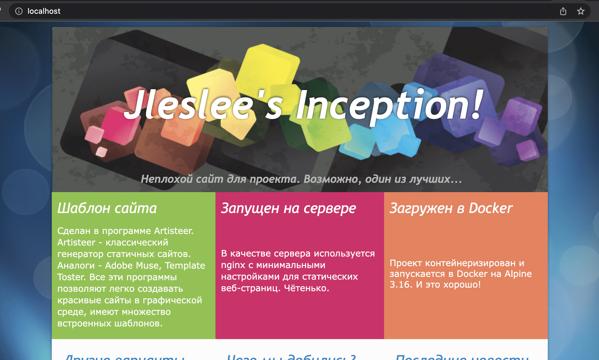
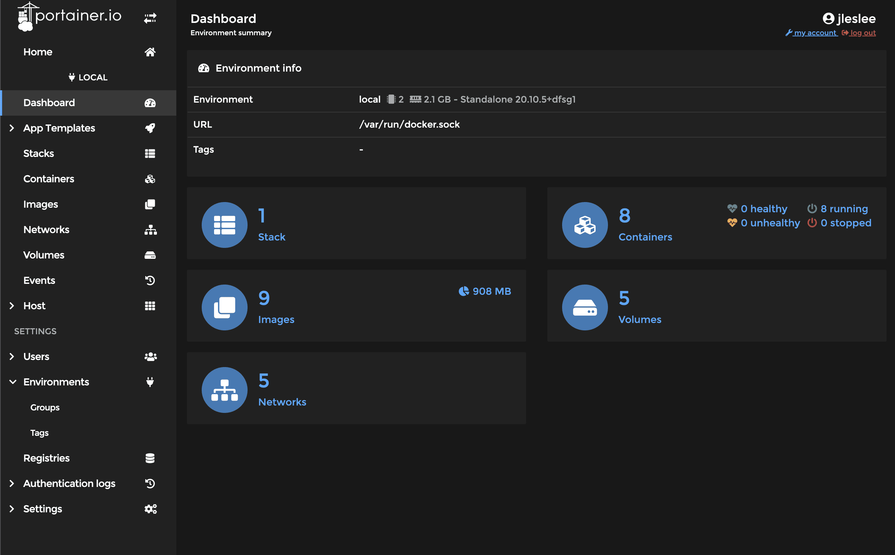
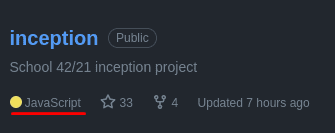

# Самописный сайт и установка portainer


## Шаг 1. Самописный сайт

По заданию мы должны создать самописный сайт используя ту технологию, которая нам ближе. Здесь каждый выбирает сам, какой язык использовать и какой контейнер создавать. Те, кому нравится JS, могут использовать контейнер с nodejs и react, любители питона могут создать страницу на django и т.д. Я не стал заморачиваться и использовал готовое решение для создания страницы - wysiwyg-редактор для генерации статичного html.

Сам сайт лежит в ``requirements/bonus/website/conf``, его можно открыть прямо в браузере, так как это html.

## Шаг 2. Dockerfile

Dockerfile берём из нашего nginx, так как html-сайт мы будем крутить на том же nginx-е. Меняем дефолтный конфиг, лежащий по адресу ``/etc/nginx/http.d/default.conf``, поместив туда простенький код указывающий другую локацию вместо стандартной (/var/www):

```
FROM alpine:3.16
RUN	apk update && apk upgrade && apk add --no-cache nginx

RUN echo "server {" > /etc/nginx/http.d/default.conf && \
    echo "root    /var/www;" >> /etc/nginx/http.d/default.conf && \
    echo "location / {" >> /etc/nginx/http.d/default.conf && \
    echo "    try_files \$uri /index.html;" >> /etc/nginx/http.d/default.conf && \
    echo "}}" >> /etc/nginx/http.d/default.conf

COPY requirements/bonus/website/conf/* /var/www/

EXPOSE 80
CMD ["nginx", "-g", "daemon off;"]
```

Копируем всё содержимое сайта при помощи маски * в нашу папку /var/www. Открываем 80-й порт (прокидывать не надо, в системе порт уже открыт). Ну и запускаем nginx без демонизации.

## Шаг 3. Секция в docker-compose

Тут мы просто берём те же исходные данные, что и у wordpress, но удаляем всё лишнее.

```
  website:
    build:
      context: .
      dockerfile: requirements/bonus/website/Dockerfile
    container_name: website
    ports:
      - "80:80"
    restart: always
```

Порт 80 у нас свободен, подключим его к нашему вебсайту, без необходимости накатывать ssl.

## Шаг 4. Запуск сайта

Если мы сделали всё правильно, переходим в папку project и делаем ``make re``. После рестарта проекта переходим на ``http://localhost`` и видим результат:



Как видим, в этом пункте бонусов нет ничего сложного. Но именно этот пункт можно усложнять до бесконечности. Хотя, вряд ли найдутся желающие попрактиковать написание сайта на ASP.NЕT в рамках школьного проекта. Но в целом такое возможно.

## Шаг 5. Portainer

Установка portainer будет отличаться от установки остальных контейнеров тем, что portainer не будет зависить от нашего docker-compose, и напротив, все наши контейнеры будут управляться через portainer.

Это крутая и очень удобная утиллита с графическим дашбордом для управления контейнерами, и скоро вы пожалеете, что познакомились с ней так поздно, только в конце проекта. Она здорово облегчила бы нам написание inception, но мы же не ищем лёгких путей, правда?

Чтобы установить portainer мы воспользуемся [официальной документацией](https://docs.portainer.io/v/ce-2.11/start/install/server/docker/linux "установить portainer"). На момент написания мною проекта inception команды были нижеследующими (в случае их изменения ориентироваться на официальную документацию, а не на гайд проекта):

Сначала мы создадим раздел для данных portainer:

``docker volume create portainer_data``

Затем загрузим и установим контейнер portainer через docker:

```
docker run -d -p 8000:8000 -p 9443:9443 --name portainer --restart=always -v /var/run/docker.sock:/var/run/docker.sock -v portainer_data:/data portainer/portainer-ce:2.11.1
```

Проверяем на странице официального сайта, не изменились ли команды, выполняем актуальные и после установки проверяем страницу portainer-а:

``https://localhost:9443``

Мы получаем уже знакомое нам предупреждение о самоподписном сертификате (да, профессиональный софт тоже их использует!), игнорируем его и переходим на страницу. Сначала нам предложат придумать пароль для дашборда. Изменить так же можно и имя пользователя. Я ввёл всё то же, что вводил для wordpress-а и нажал "создать пользователя" (create user).

После того, как меня перекинуло на страницу portainer, я перешёл в ``https://localhost:9443/#!/home`` и увидел нашу локальную конфигурацию docker. Нажав на неё, я попал на страницу управления:



Как мы можем видеть, в итоге у нас есть:

- 1 Стэк (один docker-compose файл)
- 8 Контейнеров (7 контейнеров проекта и 8-й - сам portainer)
- 9 Образов (alpine:3.16 многократно переиспользуется, потому вынесен отдельным образом)
- 6 Разделов (3 системных для docker, разделы wp-wolume db-volume и раздел portainer_data)
- 5 Сетей (3 системных + дефолтная сеть проекта + наша, созданная вручную сеть inception)

Всем этим можно управлять прямо из portainer. Так же можно создавать новые контейнеры, менять старые, запускать целые docker-compose конфигурации - в общем, управлять нашим контейнерным зоопарком так, как душе угодно. Portainer даёт возможность управлять всеми возможностями docker-а через графический интерфейс.


Но это уже совсем другая история...

## ИТОГИ

Итак, наша задача выполнена, мы создали всё, что нам необходимо по заданию.

Ура, Казань, я закончил писать свой гайд!


Теперь можно ставить мне ~~плюсик в карму~~ звезду в гите и сдавать inception с бонусами. A ~~Добби свободен~~ я пойду награжу себя обедом в доброй столовой (на правах рекламы*).

А напоследок немного юмора от GitHub:



К слову, JS-библиотеки сгенерированного artisteer-ом веб-сайта действительно занимают больше всего кода. Так что всё это время мы писали JS-проект, с чем я нас и поздравляю.
