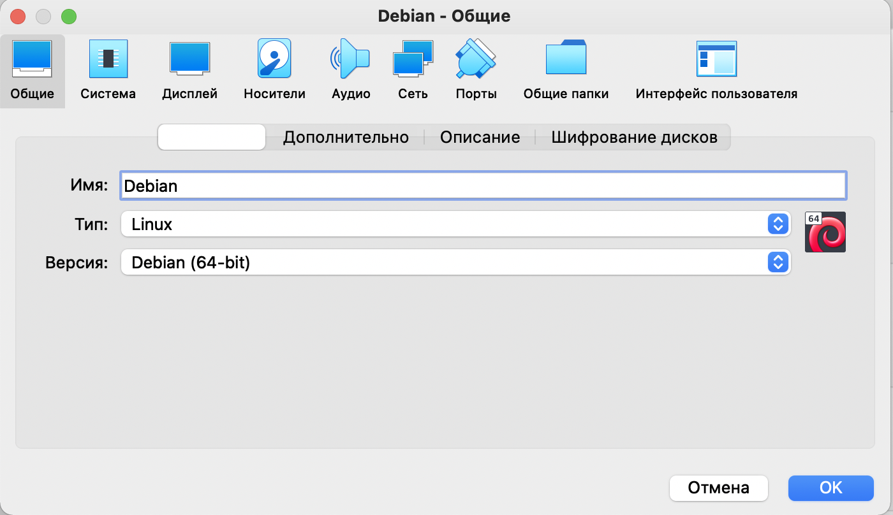
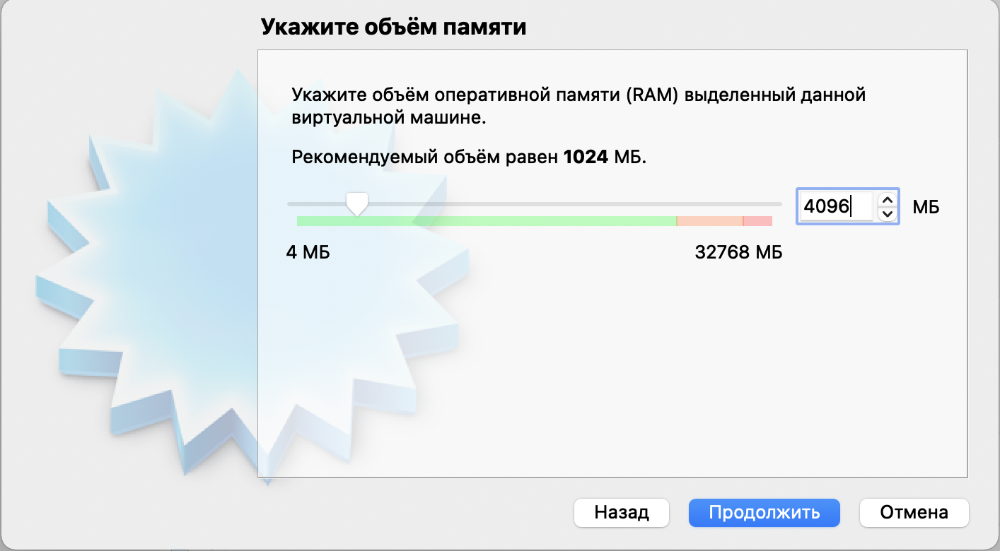

# Установка Alpine Linux в Virtualbox

## Шаг 1. Скачивание

Скачиваем версию ```VIRTUAL``` с сайта ```https://alpinelinux.org/downloads/```


## Шаг 2. Запуск

### 2.1 Создание виртуальной машины

Создайте виртуальную машину со следующими параметрами:



### 2.2 Выделение ресурсов

Можно выделить от 512 МБ оперативной памяти и не более 8 ГБ дискового пространства. На самом деле система займёт гораздо меньше.

Так же не забудьте выставить удобное разрешение экрана (коэффициент масштабирования), если работаете на mac.

В моём случае мне подошёл коэффициент 200%:



### 2.3 Выделение ресурсов процессора

Так же можно добавить системе ещё одно ядро процессора (больше не обязательно):


## Шаг 3. Установка

### 3.1 