# Установка Debian Linux в Virtualbox

## Шаг 1. Скачивание

Заходим на сайт ```https://www.debian.org/``` и скачиваем веб-инсталлер

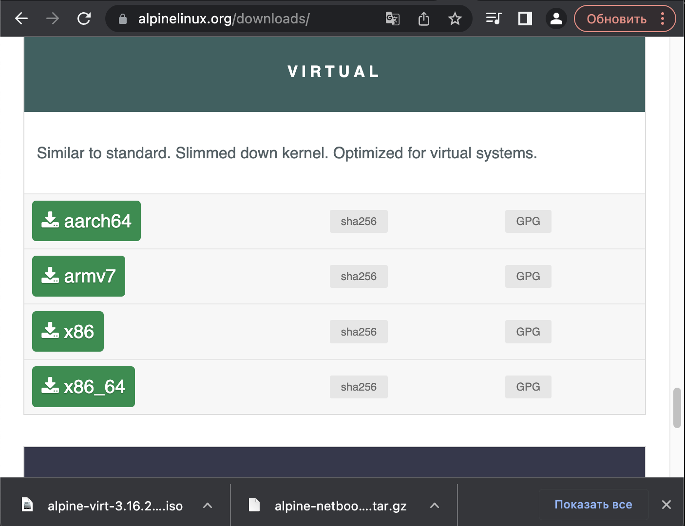

## Шаг 2. Запуск

### 2.1 Создание виртуальной машины

Создаём виртуальную машину. Называем как-либо наш проект (я назвал просто Debian) и выставляем правильную конфигурацию системы. Если проект делается на школьном mac, его папку нужно размещать в goinfre:

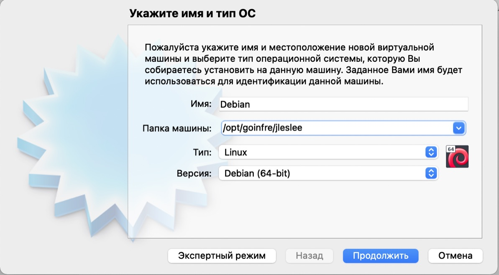

### 2.2 Выделение ресурсов

Оперативной памяти под проект можно выделить от 512 МБ если на ПК 4-8 ГБ до 4096 МБ если на ПК от 16 и выше. Больше 4 ГБ памяти на данный проект выделять бессмысленно.


 Формат выбираем VDI или VHD:

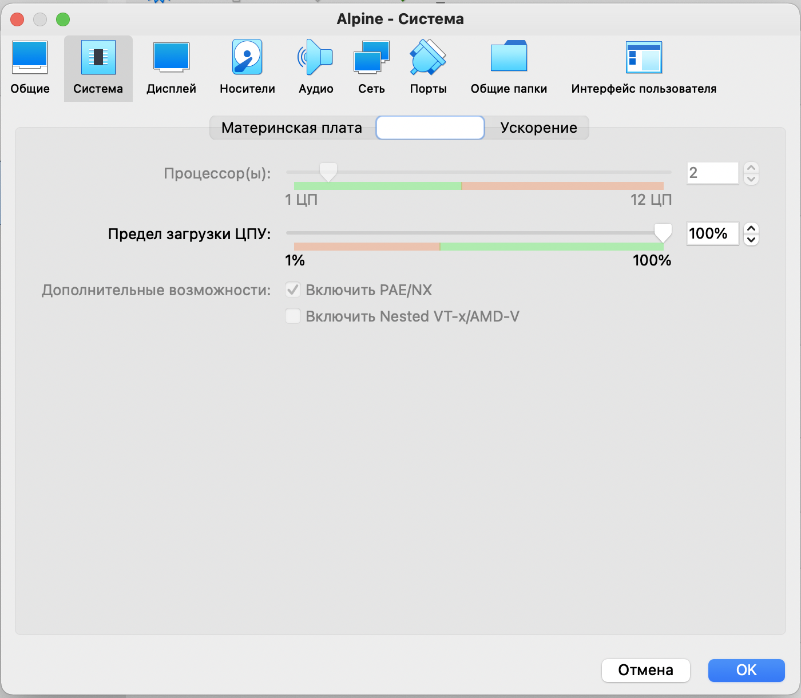

Выбираем динамический формат и выделяем под диск 8 гигабайт

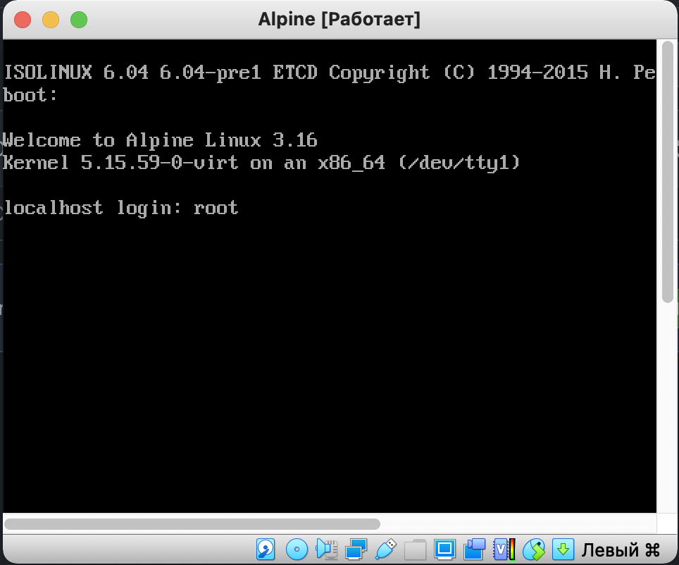

Так же не забудьте выставить удобное разрешение экрана (коэффициент масштабирования), если работаете на mac.

 На mac обычно нормально 200% или 300%:

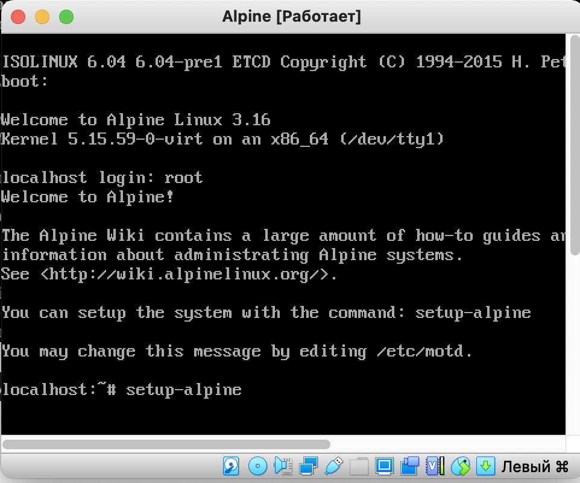

### 2.3 Выделение ресурсов процессора

Так же можно добавить системе ещё ядер. Больше четырёх добавлять избыточно:

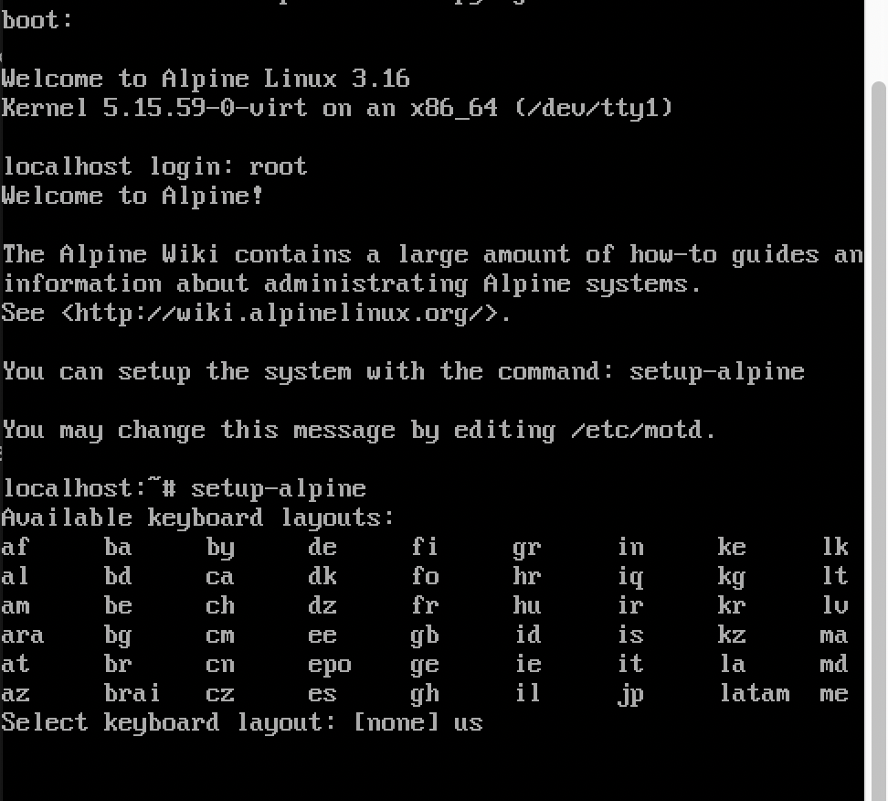

## Шаг 3. Установка

### 3.1 Начало установки

После всех настроек запускаем наш проект. При старте нас встречает меню установки. Я выбираю обычный инсталлер, но при желании можно использовать и графический, это дело вкуса.

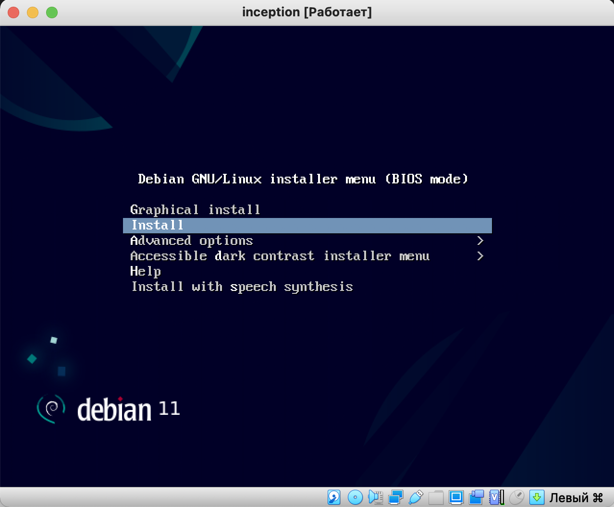

### 3.2 Выбор языка и локации

Мы можем выбрать американский английский (другие языки на проекте попросту не понадобятся), а в качестве локации указать Россию:

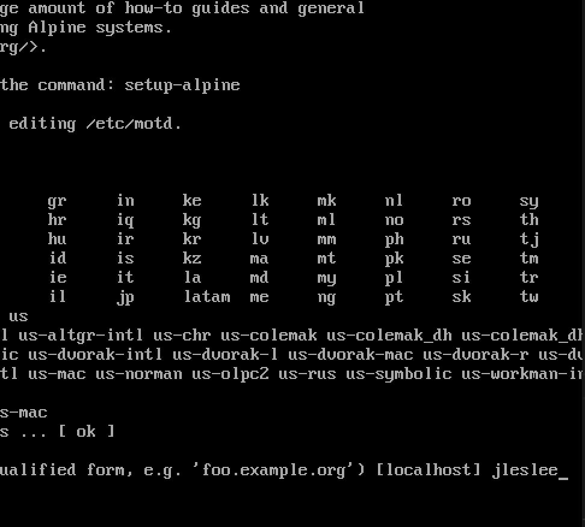

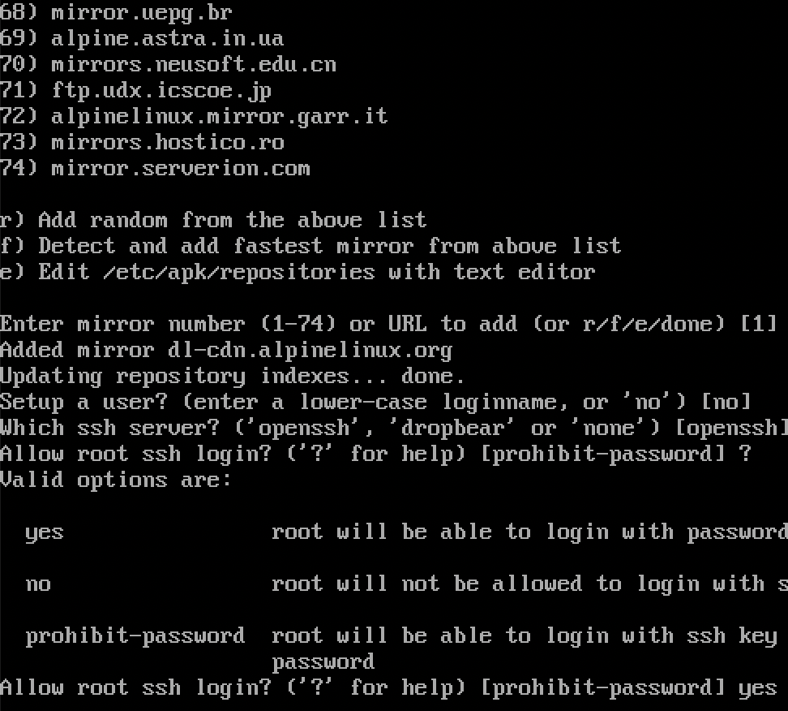

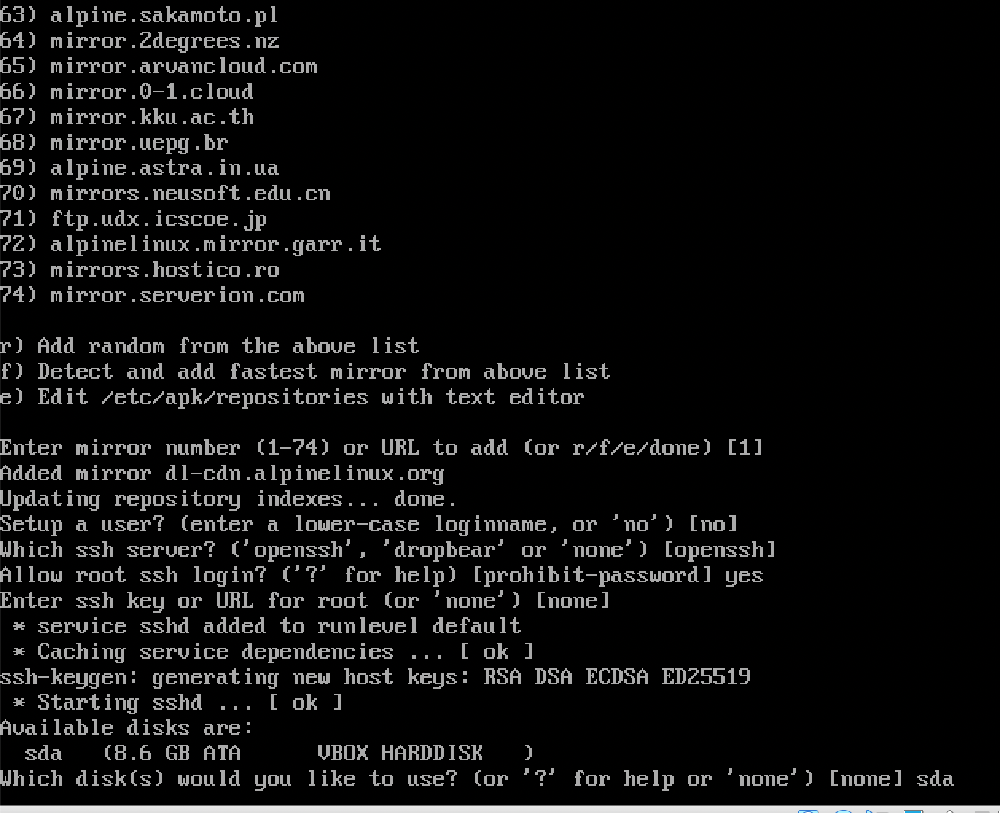

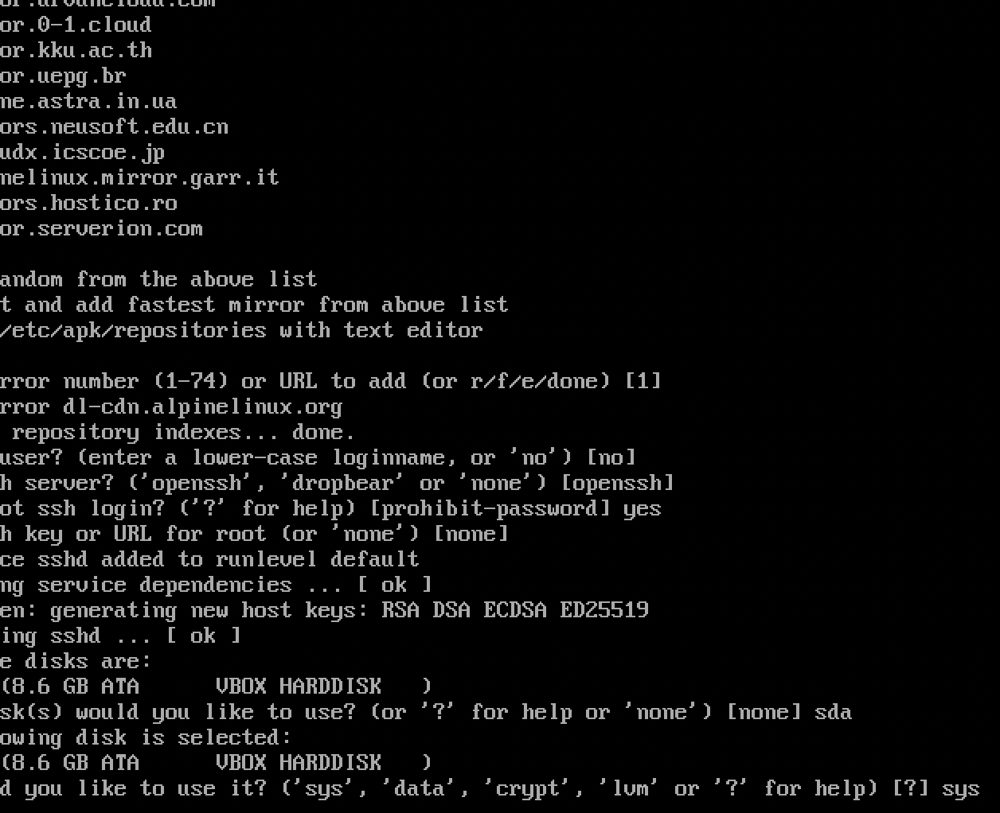

А в качестве базовой локали оставляем английский:

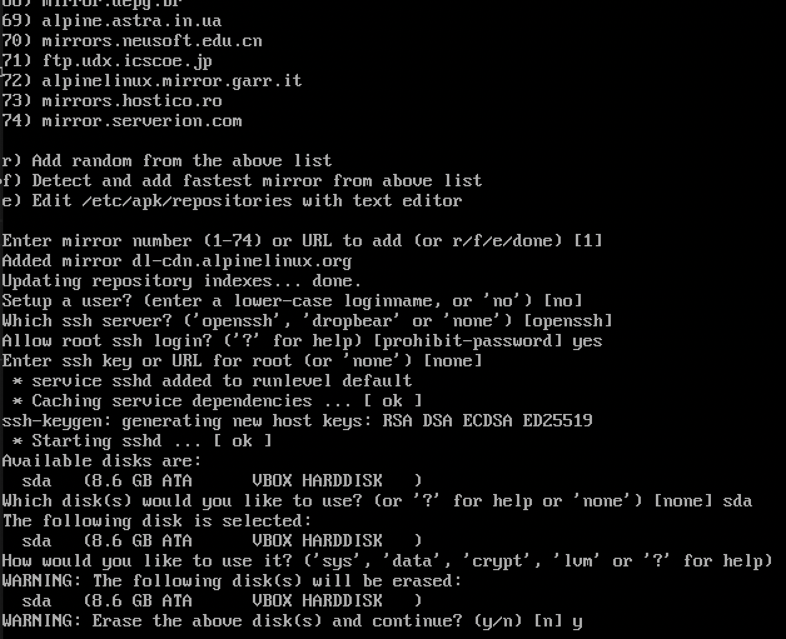

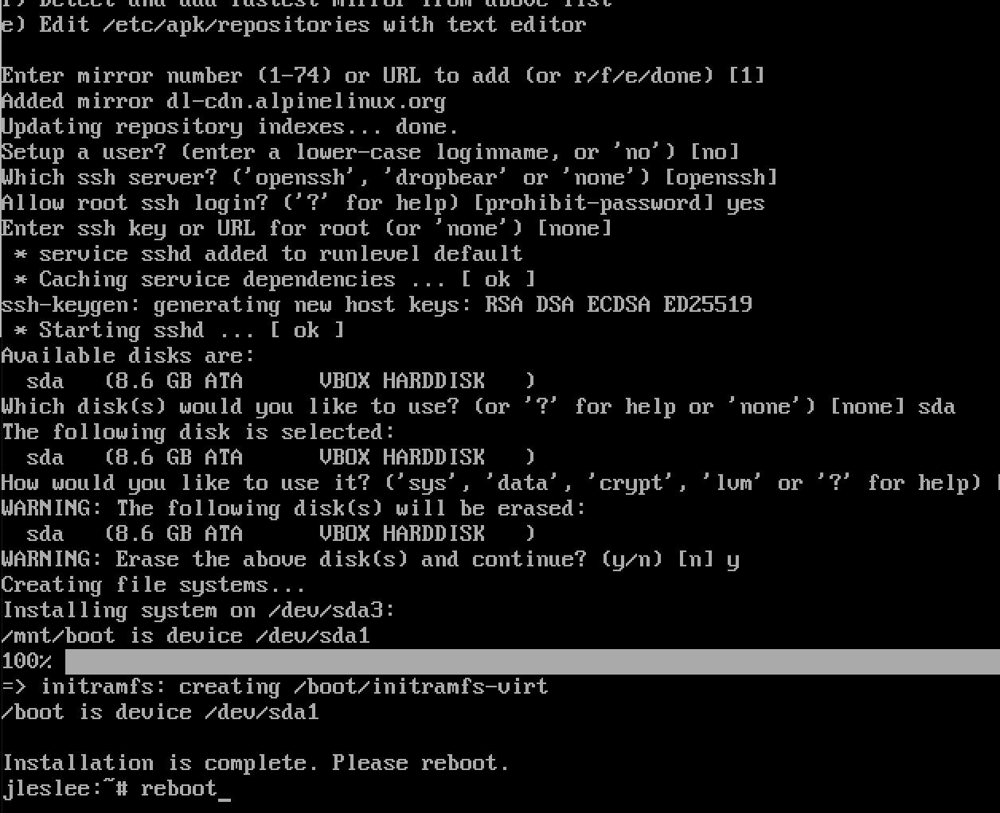

### 3.3 Настройка хоста и пользователей

Далее система предложит выбрать имя хоста. Можно назвать хост inception, однако я оставил дефолтное имя ```debian```:


Доменное имя пропускаем, оставив строку пустой.

Система предложит нам задать имя суперпользователя (root). Я назначаю руту простой пароль - цифру ```2```.

Далее нам предложат назвать как-то и обычного пользователя. Я ввожу свой ник в интре:


Принимаю это же имя в качестве имени аккаунта и ввожу простой пароль - единицу